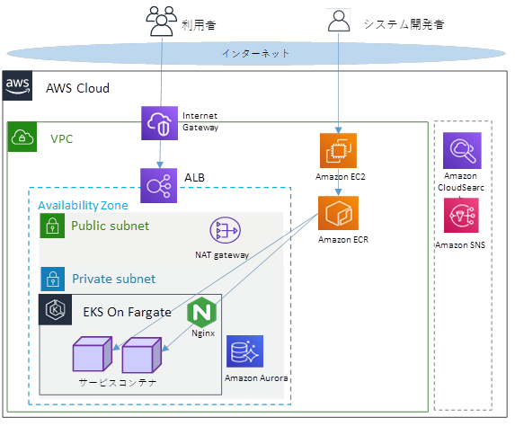

# パーソナルデータ連携モジュール 利用設定手順書

# 目次
<!-- vscode-markdown-toc -->
* 1. [はじめに](#)
	* 1.1. [本手順書の位置付け](#-1)
	* 1.2. [関連ドキュメント](#-1)
	* 1.3. [前提条件](#-1)
	* 1.4. [バージョン](#-1)
	* 1.5. [環境構成](#-1)
	* 1.6. [表記方法](#-1)
		* 1.6.1. [コマンド入力方法](#-1)
		* 1.6.2. [API入力方法](#API)
		* 1.6.3. [PxR-Block名の定義](#PxR-Block)
* 2. [PxRの起動・停止](#PxR)
	* 2.1. [PxRの起動方法](#PxR-1)
	* 2.2. [PxRの停止方法](#PxR-1)
	* 2.3. [PxR-Blockの再起動方法](#PxR-Block-1)
* 3. [PxR-Blockの追加方法](#PxR-Block-1)
	* 3.1. [追加PxR-BlockのBlockカタログ作成](#PxR-BlockBlock)
		* 3.1.1. [Tips.カタログの特定方法](#Tips.)
	* 3.2. [PF設定：追加PxR-BlockのDB構築](#PFPxR-BlockDB)
	* 3.3. [PF設定：追加PxR-BlockのEKSマニフェスト作成および起動](#PFPxR-BlockEKS)
	* 3.4. [追加PxR-Blockの割り当て](#PxR-Block-1)
	* 3.5. [アクター認定申請](#-1)
	* 3.6. [アクター認定承認、クライアント証明書の発行](#-1)
	* 3.7. [クライアント証明書のアップロード](#-1)
	* 3.8. [PF設定：EKSマニフェストアクターコード設定](#PFEKS)
* 4. [サービス設定](#-1)
	* 4.1. [グローバル設定（Block共通設定）](#Block)
	* 4.2. [運営メンバーの追加](#-1)
* 5. [PxR-Blockの削除方法](#PxR-Block-1)
	* 5.1. [アクターの終了](#-1)
		* 5.1.1. [Region終了](#Region)
		* 5.1.2. [Region利用者ID連携の解除](#RegionID)
		* 5.1.3. [APP利用者ID連携の解除](#APPID)
		* 5.1.4. [利用者IDの削除](#IdDelete)
		* 5.1.5. [Regionに参加しているAPPの離脱](#RegionAPP)
		* 5.1.6. [流通制御による利用者ID連携情報の確認](#ID)
		* 5.1.7. [アクター認定解除](#-1)
	* 5.2. [PxRサービス開始シェルのBlock削除](#ShellBlock)
	* 5.3. [PF設定：Pod停止、eksマニフェスト削除](#PFPodeks)
	* 5.4. [PF設定：DB削除](#PFDB)

<!-- vscode-markdown-toc-config
	numbering=true
	autoSave=false
	/vscode-markdown-toc-config -->
<!-- /vscode-markdown-toc -->

##  1. <a name=''></a>はじめに

###  1.1. <a name='-1'></a>本手順書の位置付け
パーソナルデータ連携モジュール
利用手順書（以降、本書）は、パーソナルデータ連携モジュール（以降、本モジュール）を利用するにあたり、本モジュールの起動・停止方法、PxR-Blockの設定項目の設定方法、PxR-Blockの追加・削除方法について記載したものです。

###  1.2. <a name='-1'></a>関連ドキュメント
本手順書に関連するドキュメントを以下に示します。

**表 1‑1‑1　関連ドキュメント**

| ドキュメント名 |
| - |
| パーソナルデータ連携モジュール 構築ガイド |
| パーソナルデータ連携モジュール アプリケーション開発ガイド |

###  1.3. <a name='-1'></a>前提条件
前提条件を以下に示します。
・インターネットへアクセス可能であること。
・「パーソナルデータ連携モジュール構築ガイド」を前提に、本モジュールを構築していること。


###  1.4. <a name='-1'></a>バージョン
別紙「パーソナルデータ連携モジュール 構築ガイド」1.4を参照のこと。

###  1.5. <a name='-1'></a>環境構成
本手順で説明する環境構成イメージを下図に示します。



**図 1‑1 AWSを使用した環境構成イメージ**

###  1.6. <a name='-1'></a>表記方法

####  1.6.1. <a name='-1'></a>コマンド入力方法

（例）：Linuxコマンド入力
```
# kubectl apply -f . -R
# kubectl rollout restart -n pxr deployments/<追加Blockのdeployment名>
```

※行頭の \# はプロンプトであり、以降のコマンドを入力する。  
※＜＞部分は修正箇所を示し、＜＞内はユーザ設定値、もしくはAPI取得値を示す。

（例）：ファイル編集
```
apiVersion: v1
kind: ConfigMap
metadata:
  name: application000001-operator-service-container-config-map
  namespace: pxr
data:
  config.json: |
    {
      "session_expire": 168,
      "login_code_expire": 10,
      "initial_password_expire": 7,
      "cookie_base_name":"operator_type%s_session",
      "catalog_url":"http://localhost:3003/pxr-block-proxy/?block=1000401&path=/catalog",
      "catalog_ext_name": "xxx-healthcare-consortium",
      "ca_url": "http://localhost:3012/certification-authority",
      "block": {
        "_value": <PxR-Blockコード>,
        "_ver": 【1】
      },
      "actor": {
        "_value": 【null】,
        "_ver": 【null】
      },
~~~以降省略~~~
```
※【】もしくは＜＞部分は修正箇所を示し、＜＞内はユーザ設定値、もしくはAPI取得値を示す。

####  1.6.2. <a name='API'></a>API入力方法

（例）：APIパス

<table>
<colgroup>
<col style="width: 31%" />
<col style="width: 31%" />
<col style="width: 37%" />
</colgroup>
<thead>
<tr class="header">
<th>サービス名称</th>
<th>API名称</th>
<th>メソッドおよびパス</th>
</tr>
</thead>
<tbody>
<tr class="odd">
<td>カタログサービス</td>
<td>更新</td>
<td><p>PUT /catalog/ext/{code}</p>
<p>※proxyを経由するため以下のパスになります。</p>
<p>/pxr-block-proxy/pxr-block-proxy/?path=/catalog/ext/{code}</p></td>
</tr>
</tbody>
</table>

APIパス使用例：https://\<ドメイン\>【/catalog/catalog/ext/{code}】

※ドメインの後ろにAPIパスをつなげて使用する。

（例）：APIレスポンス
```
{
"catalogItem": {
  "ns": "【catalog/ext/{ext_name}/setting/actor-own/{actor_type}/actor_{actor_code}】",
  "name": "【設定の名称】",
  "_code": {
    "_value": 【対象のコード】,
    "_ver": 【対象のバージョン】
  },
    "inherit": {
    "_value": 【継承元カタログコード】,
    "_ver": 【継承元カタログバージョン】
  },
```

※【】はユーザー設定値、もしくはResponseで取得できる設定値を示す。

####  1.6.3. <a name='PxR-Block'></a>PxR-Block名の定義
PxR-Block論理名と物理名は以下前提で説明します。
表 1‑2 PxR-Block論理名と物理名対比表

<table>
<colgroup>
<col style="width: 23%" />
<col style="width: 31%" />
<col style="width: 45%" />
</colgroup>
<thead>
<tr class="header">
<th><blockquote>
<p>PxR-Block論理名</p>
</blockquote></th>
<th><blockquote>
<p>PxR-Block物理名</p>
<p>（Kubernetes Pod名、DB名）</p>
</blockquote></th>
<th><blockquote>
<p>補足</p>
</blockquote></th>
</tr>
</thead>
<tbody>
<tr class="odd">
<td><blockquote>
<p>PxR-Root-Block</p>
</blockquote></td>
<td><blockquote>
<p>root-api　　※例</p>
</blockquote></td>
<td><blockquote>
<p>構築ガイドで作成するPxR-Block<br />
※物理名は任意</p>
</blockquote></td>
</tr>
<tr class="even">
<td><blockquote>
<p>APP-Block</p>
</blockquote></td>
<td><blockquote>
<p>application000001-api　※例</p>
</blockquote></td>
<td rowspan="2"><blockquote>
<p>「3 PxR-Blockの追加方法」で作成する。</p>
<p>※物理名は任意</p>
</blockquote></td>
</tr>
<tr class="odd">
<td><blockquote>
<p>Region-Root-Block</p>
</blockquote></td>
<td><blockquote>
<p>region000001-api　※例</p>
</blockquote></td>
</tr>
</tbody>
</table>

##  2. <a name='PxR'></a>PxRの起動・停止
本章では、本モジュールの起動・停止・再起動方法について記載する。

###  2.1. <a name='PxR-1'></a>PxRの起動方法
以降に、PxRの開始手順を記載する。

1. DB（AWS Aurora）を起動する。
```
# aws rds start-db-cluster --db-cluster-identifier ＜DBクラスター＞
```
2. KubernetesのPod起動を行う。

Scaleコマンドの—replicasに値を設定してPxR-Root-Blockおよび追加PxR-BlockのPodを起動する。
※Podの冗長化を行う場合は、--replicasの数を増やす。
```
# kubectl scale deploy/root-api --replicas=【1】 -n pxr
# kubectl scale deploy/＜開始対象のPxr-Blockの物理名＞ --replicas=【1】 -n pxr
```
※起動したいPodのdeployment を行う。

3. KubernetesのPodステータス一覧を確認し、Running（動作中）に変われば起動完了となる。

※Podステータス一覧レスポンス例
```
# kubectl get Pod -n pxr
  NAME                                    READY   STATUS    RESTARTS   AGE
  application000001-api-df4dbb5f5-pgxnw　  9/9    Running     0           13h
  region000001-api-6884664976-zzbgg       7/7    Running     0           13h
  root-api-86df7cffb9-btrsc                  13/13   Running     0           13h
```

###  2.2. <a name='PxR-1'></a>PxRの停止方法

以降に、PxRの停止手順を記載する。

1.  Kubernetesのdeploy一覧を確認する。

※Podステータス一覧レスポンス例
```
# kubectl get deploy -n pxr
  NAME                    READY   UP-TO-DATE   AVAILABLE   AGE
  application000001-api    1/1         1              1           75d
  region000001-api        1/1         1              1           75d
  root-api                  1/1         1              1           75d
```
2.  KubernetesのPod停止を行う。

Scaleコマンドで—replicas=0を設定して、PodのUndeployを行う。
```
# kubectl scale deploy/root-api --replicas=【0】 -n pxr
# kubectl scale deploy/＜停止対象のPxr-Blockの物理名＞ --replicas=【0】 -n pxr
```
※すべてのPodを停止する。

3.  DB（AWS Aurora）を停止する。
```
# aws rds stop-db-cluster --db-cluster-identifier ＜DBクラスター名＞
```
4.  KubernetesのPodステータス一覧を確認し、停止していることを確認する。

※Podステータス一覧レスポンス例
```
# kubectl get Pod -n pxr
  No resources found in pxr namespace.
```
###  2.3. <a name='PxR-Block-1'></a>PxR-Blockの再起動方法

以降にPxR-Blockの再起動手順を記載する。

1.  対象PodのPxR-Blockを再起動する。

KubernetesのRestartコマンドで再起動実行する。
```
# kubectl rollout restart -n pxr deployments/<PxR-Block物理名> -n pxr
```
2.  KubernetesのPodステータス一覧を確認し、Running（動作中）に変われば起動完了となる。

※Podステータス一覧レスポンス例
```
# kubectl get Pod -n pxr
  application000001-api-df4dbb5f5-pgxnw　 10/10    Running     0           13h
  region000001-api-6884664976-zzbgg      7/7      Running     0           13h
  root-api-86df7cffb9-btrsc                  17/17    Running     0           13h
```
##  3. <a name='PxR-Block-1'></a>PxR-Blockの追加方法

本章では本モジュールにおける、PxR-Blockを追加する手順について記載する。

本モジュールにおけるPxR-Block追加は、以下フロー図の流れで追加処理を行う。

※PxR-Blockの追加は、以下の構築手順でシステム全体を停止せずに追加処理が可能
<center></center>

<center>図 3‑1 PxR-Block追加フロー</center>

###  3.1. <a name='PxR-BlockBlock'></a>追加PxR-BlockのBlockカタログ作成

PxR-Root-Blockのアクターが、新規Blockのカタログ作成、Blockコードの取得を行う。

※PxR-Root-Blockにログインセッションを確立して実施する。

1.  PxR-Root-Blockにログインする。

| サービス名称         | API名称  | メソッドおよびパス   |
|----------------------|----------|----------------------|
| オペレーターサービス | ログイン | POST /operator/login |

> リクエスト
```
{
  "type": 3,
  "loginId": "【ログインID】",
  "hpassword": "【ハッシュパスワード】"
} 
```
※ハッシュパスワードは、パスワードを、「構築ガイド」の2.4マニフェスト作成、適用でConfigmapに設定したソルト値とハッシュ化回数でハッシュ化（SHA-256）したパスワード

> **ログイン後のAPI使用について**
>
> ログイン後に各APIを使用するためにはログイン時に返却される「sessionId」と「XSRF-TOKEN」を設定する必要がある。

a.  sessionId

  ログインAPIのレスポンス内で各APIを使用するための「sessionId」が返却される。

  例：ログインAPIのレスポンス
```
{
  "sessionId": "【cab7561a298146422016cece0e892c3e93287b98bd24357efebcb2d29195eada】",
  "operatorId": 1,
  "type": 3,
  "loginId": "ログインID",
  "name": "管理者",
  "auth": --- 省略 ---,
  "lastLoginAt": "2022-06-21T15:53:43.226+0900",
  "passwordChangedFlg": true,
  "loginProhibitedFlg": false,
  "attributes": {
    "smsAuth": false
  },
  "block": {
    "_value": 1000401,
    "_ver": 1
  },
  "actor": {
    "_value": 1000431,
    "_ver": 1
  }
}
```
  各APIを使用する際にリクエストのcookieに以下の形式で設定する。
```
cookie: operator_type3_session=“発行されたsessionId”
```

b.  XSRF-TOKEN

  ログインAPIのレスポンスのset-cookieで各APIを使用するための「XSRF-TOKEN」が返却される。

  例：
```
set-cookie: XSRF-TOKEN=wNS5VFAK-tryomg1zs1omhd7tk2fkgifmrkg;
```
  各APIを使用する際にリクエストのheaderに以下の形式で設定する。
```
x-xsrf-token: “発行されたXSRF-TOKEN”
```

2.  PxR-Root-Blockでカタログ作成APIを実行する。

  本手順により各アクターに割り当てられるBlockのカタログを作成する。

<table>
<colgroup>
<col style="width: 34%" />
<col style="width: 21%" />
<col style="width: 44%" />
</colgroup>
<thead>
<tr class="header">
<th>サービス名称</th>
<th>API名称</th>
<th>メソッドおよびパス</th>
</tr>
</thead>
<tbody>
<tr class="odd">
<td>カタログサービス</td>
<td>拡張追加</td>
<td><p>PUT /catalog/ext</p>
<p>※proxyを経由するため以下のパスになります。</p>
<p>/pxr-block-proxy/pxr-block-proxy/?path=/catalog/ext</p></td>
</tr>
</tbody>
</table>

  リクエスト
  ```
  {
  "catalogItem": {
    "ns": "【catalog/ext/{ext_name}/block/{actor_type}】",
    "name": "【ブロック名称】",
    "_code": null,
    "inherit": {
      "_value": 【継承元カタログコード】,
      "_ver": 【継承元カタログバージョン】
    },
    "description": {
      "title": null,
      "section": [
        {
          "title": "【ブロック概要-タイトル】",
          "content": [
            {
              "sentence": "【ブロック概要-本文】"
            }
          ]
        }
      ]
    }
  },
  "template": {
    "value": [
      {
        "key": "actor-type",
        "value": "【アクターのタイプ】"
      },
      {
        "key": "assigned-organization",
        "value": null
      },
      {
        "key": "assignment-status",
        "value": "unassigned"
      },
      {
        "key": "base-url",
        "value": "【ポータルのURL】"
      },
      {
        "key": "first-login-url",
        "value": "【ポータルの初回ログインURL】"
      },
      {
        "key": "id",
        "value": "【識別用ID】"
      },
      {
        "key": "pxr-portal-first-login-url",
        "value": null
      },
      {
        "key": "service-name",
        "value": "【サービス名称】"
      }
    ]
  },
  "attribute": null
}
  ```

<table>
<colgroup>
<col style="width: 40%" />
<col style="width: 59%" />
</colgroup>
<thead>
<tr class="header">
<th>名称</th>
<th>説明</th>
</tr>
</thead>
<tbody>
<tr class="odd">
<td>catalog/ext/{ext_name}/block/{actor_type}</td>
<td><p>・{ ext_name }</p>
<p>設定されているext名に置き換える。</p>
<p>・{actor_type}</p>
<p>Blockを使用する対象のアクターのタイプに置き換える。</p>
<p>　アプリケーションP：app</p>
<p>　領域運営SP：region-root</p></td>
</tr>
<tr class="even">
<td>ブロック名称</td>
<td>作成対象Blockの名称を設定する。</td>
</tr>
<tr class="odd">
<td>継承元カタログコード</td>
<td><p>継承元となるカタログのコードを設定する。</p>
<p>（「3.1.1Tips.カタログの特定方法（P<a
href="#tips.カタログの特定方法">16</a>）」を参照し、NS「catalog/model/block/{actor_type}」で取得する）</p></td>
</tr>
<tr class="even">
<td>継承元カタログバージョン</td>
<td><p>継承元となるカタログのバージョンを設定する。</p>
<p>（「3.1.1Tips.カタログの特定方法（P<a
href="#tips.カタログの特定方法">16</a>）」を参照し、NS「catalog/model/block/{actor_type}」で取得する）</p></td>
</tr>
<tr class="odd">
<td>ブロック概要-タイトル</td>
<td>作成対象Blockの概要分のタイトルを設定する。</td>
</tr>
<tr class="even">
<td>ブロック概要-本文</td>
<td>作成対象Blockの概要分の本文を設定する。</td>
</tr>
<tr class="odd">
<td>アクターのタイプ</td>
<td><p>Blockを使用する対象のアクターのタイプを設定する。</p>
<p>　アプリケーションP：app</p>
<p>　領域運営SP：region-root</p></td>
</tr>
<tr class="even">
<td>ポータルのURL</td>
<td><p>対象のアクター用ポータルのベースURLを設定する。</p>
<p>例）https://[base-url]/portal/login</p></td>
</tr>
<tr class="odd">
<td>ポータルの初回ログインURL</td>
<td>PxR-Block以外はnullが設定される。</td>
</tr>
<tr class="even">
<td>識別用ID</td>
<td>Blockの固有IDを設定する。※他Blockとの同名不可</td>
</tr>
<tr class="odd">
<td>サービス名称</td>
<td><p>PxR-Blockのサービス名を設定する。※他Blockとの同名不可</p>
<p>例：region000001-service</p></td>
</tr>
</tbody>
</table>

APIのレスポンスから、作成されたカタログのコードを確認する。  

  レスポンス例
  ```
  {
  "catalogItem": {
    "ns": "catalog/model/unit/si/length",
    "name": "cm",
    "description": "センチメートル",
    "_code": {
      "_value": 【100046】,
      "_ver": 【1】
    },
    "inherit": null
  },
  "template": {
    "_code": {
      "_value": 1,
      "_ver": 1
    },
    "additionalProp1": {}
  },
  "prop": [
    {
      "key": "index",
      "type": "string"
    },
    {
      "key": "format",
      "type": {
        "of": "item",
        "_code": {
          "value": -9,
          "ver": 1
        },
        "candidate": null
      }
    }
  ]
}
  ```
※【】はカタログコード、もしくはカタログバージョンを示す。


####  3.1.1. <a name='Tips.'></a>Tips.カタログの特定方法
NS検索APIからカタログを取得する。

<table>
<colgroup>
<col style="width: 22%" />
<col style="width: 16%" />
<col style="width: 60%" />
</colgroup>
<thead>
<tr class="header">
<th>サービス名称</th>
<th>API名称</th>
<th>メソッドおよびパス</th>
</tr>
</thead>
<tbody>
<tr class="odd">
<td>カタログサービス</td>
<td>取得</td>
<td><p>GET /catalog?ns={NS}</p>
<p>※PxR-Root-Block以外のPxR-BlockでPxR-Root-BlockのAPIを使用する場合は、proxyを経由するため以下のパスになります。</p>
<p>PUT</p>
<p>/pxr-block-proxy/pxr-block-proxy/?block=$pxr-root-block&amp;path=%2Fcatalog%3Fns%3D{NS}</p></td>
</tr>
</tbody>
</table>

  ※{NS}は検索対象のカタログにより異なる。

レスポンス例
```
[
  {
    "catalogItem": {
      "ns": "catalog/model/setting/actor-own/app",
      "name": "setting",
      "_code": {
        "_value": 【100068】,
        "_ver": 【1】
      },
      "inherit": null,
      "description": "アプリケーションプロバイダーによるアクター個別設定の定義です。"
    },
    "template": {
      "_code": {
        "_value": 168,
        "_ver": 1
      },
      "use_multifactor_authentication": null,
      "use_user_information": null
    },
    "prop": [
      {
        "key": "use_multifactor_authentication",
        "type": {
          "of": "boolean",
          "cmatrix": null
        },
        "description": "2要素認証",
        "isInherit": false
      },
      {
        "key": "use_user_information",
        "type": {
          "of": "boolean",
          "cmatrix": null
        },
        "description": "利用者管理情報使用設定",
        "isInherit": false
      }
    ],
    "value": null,
    "attribute": null
  }
]
```
※【】はカタログコード、もしくはカタログバージョンを示す。


###  3.2. <a name='PFPxR-BlockDB'></a>PF設定：追加PxR-BlockのDB構築

1.  追加するPxR-BlockのDBを構築する。

別紙：『構築ガイドの2.3
DB構築』を参照して、追加するBlockのDB接続ユーザーの作成、DB作成、スキーマの作成、テーブルの作成を実施する。

2.  追加するPxR-Blockに運営メンバー（初期ユーザー）を登録する。

別紙：『構築ガイドの2.7
初期ユーザー登録』を参照して、追加するPxR－Blockの初期ユーザーを登録する。

※初期ユーザーから他運営メンバーの追加方法（参照：「4.2運営メンバーの追加」）

###  3.3. <a name='PFPxR-BlockEKS'></a>PF設定：追加PxR-BlockのEKSマニフェスト作成および起動

追加PxR-BlockのEKSマニフェストの作成および適用手順を記載する。

1.  追加PxR-Blockのマニフェストファイルの作成・設定を行う。

<!-- -->

a.  Configmap/＜ベースPxR-Block＞/\*.yamlを＜追加PxR-Block名＞ディレクトリにコピーして、＜追加PxR-Block名＞に変更する。

　・コピーしたディレクトリの\*.yamlファイル内の文字列＜ベースPxR-Block名＞を＜追加PxR-Block名＞に変換する。

対象ファイル：別紙『構築ガイドの2.1資材入手』を参照のこと。

APP-Blockの場合：application000001

Region-Root-Blockの場合：region000001

サンプル：operator-service-container.yaml　※他全ファイル、全箇所を対象に変更する
```
apiVersion: v1
kind: ConfigMap
metadata:
  name: ＜ベースPxR-Block名＞-operator-service-container-config-map
  namespace: pxr
data:
  config.json: |
    {
      "session_expire": 168,
      "login_code_expire": 10,

~~~ 以降省略 ~~~ 
```
Grep置換方法例
```
# sed -i -e ‘s/＜ベースPxR－Block名＞/＜追加PxR－Block名＞/’ ＜対象ファイル＞
```
b.  同様にdeployment/＜ベースPxR-Block名＞-deployment.yamlをファイルコピーして、＜追加PxR-Block名＞に変更する。

　・コピーしたdeployment.yamlのファイル名を＜追加PxR-Block名＞-deployment.yamlに変更する。

　・ファイル内の文字列＜ベースPxR-Block名＞を＜追加PxR-Block名＞に変換する。

Grep置換方法例
```
# sed -i -e ‘s/＜ベースPxR－Block名＞/＜追加PxR－Block名＞/’ ＜対象ファイル＞
```
c.  同様にservice/＜ベースPxR-Block名＞-service.yamlをファイルコピーして、に＜追加PxR-Block名＞に変更する。

　・コピーしたservice.yamlのファイル名を＜追加PxR-Block名＞-service.yamlに変更する。

　・ファイル内の文字列＜ベースPxR-Block名＞を＜追加PxR-Block名＞に変換する。

Grep置換方法例
```
# sed -i -e ‘s/＜ベースPxR－Block名＞/＜追加PxR－Block名＞/’ ＜対象ファイル＞
```
d.  構築手順で作成したIngres
    /pxr-ingress.yamlに＜追加Block＞のIngress設定を追加する。

対象ファイル：別紙『構築ガイドの2.1資材入手』で示すingress/pxr-ingress.yaml

サンプル：pxr-ingress.yaml　※最終行に＜追加PxR-Block＞のIngress設定を追加する。

※ドメインとなる「XXXXX. me.uk」は構築時に使用したドメインを記載する。
```
  - host: root.XXXXX. me.uk
    http:
      paths:
      - path: /*
        backend:
          serviceName: root-service
          servicePort: 80

  - host: ＜追加PxR-Block＞. XXXXX. me.uk
    http:
      paths:
      - path: /*
        backend:
          serviceName: ＜追加PxR-Block＞-service
          servicePort: 80

```


2.  DB構築時に設定したDB設定値を、各コンテナのyamlファイルに設定する。

configmap/＜追加PxRBlock＞/の各コンテナyamlファイルのormconfig.json定義部分をＤＢ構築のときに設定したデータベース名、スキーマ名、ユーザー名、パスワードを設定する。※追加BlockのConfigmap全コンテナyamlファイルに設定する。

別紙：『構築ガイドの2.5 マニフェスト作成、適用』の手順 3
ormconfig.json編集を参照

3.  configmap/common-configmap.yamlを編集し、追加PxR-Blockコードを設定する。

  \<PxR-Blockコード\>、\_Verは「3.1追加PxR-BlockのBlockカタログ作成」で確定したBlockコード、およびverを使用する。

  ”actor”の”\_value”と”\_ver”はnullを設定してください。  

※上段の定義をコピー追加して下段の定義を作成し、Blockコード、アクターコードの設定を行う  
　（「apiVersion: v1」から「---」までを上段とする）

```
~~~以前省略~~~
apiVersion: v1
kind: ConfigMap
metadata:
  name: application000001-common-config-map
  namespace: pxr
data:
  block-common-conf.json: |
    {
      "block": {
        "_value": 1000407,
        "_ver": 1
      },
      "actor": {
        "_value": 1000436,
        "_ver": 1
      }
    }
---
apiVersion: v1
kind: ConfigMap
metadata:
  name: 【application000004】-common-config-map
  namespace: pxr
data:
  block-common-conf.json: |
    {
      "block": {
        "_value": <PxR-Blockコード>,
        "_ver": 1
      },
      "actor": {
        "_value": 【null】,
        "_ver": 【null】
      }
    }
~~~以降省略~~~
```


4.  Kubernetes
    のConfigmap、deployment、Service、Ingressのyaml適用、Podの起動を行う。
```
# kubectl apply -f . -R
```
  ※上記コマンドで実行ディレクトリ配下のyamlの更新が行われる。

  追加PxR-Blockのdeployment.yamlのyaml適用でPodが起動されない場合は、「2.1
  PxRの起動方法」で追加PxR-Blockの起動を行う。

5.  KubernetesのPodステータスを確認して、追加PxR-Blockが、Running（動作中）に変われば起動完了となる。

※Podステータス一覧レスポンス例
```
# kubectl get Pod -n pxr
  application000001-api-df4dbb5f5-pgxnw　 10/10    Running     0           13h
  region000001-api-6884664976-zzbgg      7/7      Running     0           13h
  root-api-86df7cffb9-btrsc                  17/17    Running     0           13h
```
###  3.4. <a name='PxR-Block-1'></a>追加PxR-Blockの割り当て

PxR-Root-Blockのアクターが、追加したPxR-Blockの割り当てを行う。

※PxR-Root-Blockにログインセッションを確立して実施する。

1.  PxR-Root-Blockにログインする。

| サービス名称         | API名称  | メソッドおよびパス   |
|----------------------|----------|----------------------|
| オペレーターサービス | ログイン | POST /operator/login |

  リクエスト
```
{
  "type": 3,
  "loginId": "【ログインID】",
  "hpassword": "【ハッシュパスワード】"
} 
```
※ハッシュパスワードは、パスワードを、「構築ガイド」の2.4マニフェスト作成、適用でConfigmapに設定したソルト値とハッシュ化回数でハッシュ化（SHA-256）したパスワード

2.  PxR-Root-Blockでカタログ変更APIを実行する。

  本手順によりBlockカタログを割当状態に変更する。

<table>
<colgroup>
<col style="width: 33%" />
<col style="width: 24%" />
<col style="width: 42%" />
</colgroup>
<thead>
<tr class="header">
<th>サービス名称</th>
<th>API名称</th>
<th>メソッドおよびパス</th>
</tr>
</thead>
<tbody>
<tr class="odd">
<td>カタログサービス</td>
<td>更新</td>
<td><p>PUT /catalog/ext/{code}</p>
<p>※proxyを経由するため以下のパスになります。</p>
<p>/pxr-block-proxy/pxr-block-proxy/?path=/catalog/ext/{code}</p></td>
</tr>
</tbody>
</table>

  リクエスト（block追加時のリクエスト時の内容を引き継いでください）
```
{
  "catalogItem": {
    "ns": "catalog/ext/{ext_name}/block/{actor_type}",
    "name": "ブロック名称",
    "_code": {
      "_value": 【作成時に確認したカタログコード】
      "_ver": 【作成時に確認したカタログバージョン】
    },
    "inherit": {
      "_value": 継承元カタログコード,
      "_ver": 継承元カタログバージョン
    },
    "description": {
      "title": null,
      "section": [
        {
          "title": "ブロック概要-タイトル",
          "content": [
            {
              "sentence": "ブロック概要-本文"
            }
          ]
        }
      ]
    }
  },
  "template": {
    "value": [
      {
        "key": "actor-type",
        "value": "アクターのタイプ"
      },
      {
        "key": "assigned-organization",
        "value": “【Block割り当てを行う組織名称】”
      },
      {
        "key": "assignment-status",
        "value": "【assigned】"
      },
      {
        "key": "base-url",
        "value": "ポータルのURL"
      },
      {
        "key": "first-login-url",
        "value": "ポータルの初回ログインURL"
      },
      {
        "key": "id",
        "value": "識別用ID"
      },
      {
        "key": "pxr-portal-first-login-url",
        "value": null
      },
      {
        "key": "service-name",
        "value": "サービス名称"
      }
    ]
  },
  "attribute": null
}
```
  ※【】部分を変更する。

3.  追加PxR-
    Blockのアクターに、URL情報、初期ログインID、初期パスワードの連絡、および「3.5アクター認定申請」の実施連絡を行う。

###  3.5. <a name='-1'></a>アクター認定申請

追加PxR-Blockのアクターが、アクター認定申請を行う。

※追加PxR-Blockにログインセッションを確立して実施する。

1.  アクター認定申請を行う追加Blockにログインする。

| サービス名称         |          | API名称 |                      | メソッドおよびパス |
|------------------|--|------------------|--|---------------------------------|
| オペレーターサービス | ログイン |         | POST /operator/login |                    |

  リクエスト
```
{
  "type": 3,
  "loginId": "【ログインID】",
  "hpassword": "【ハッシュパスワード】"
}
```
※ハッシュパスワードは、パスワードを、「構築ガイド」の2.4マニフェスト作成、適用でConfigmapに設定したソルト値とハッシュ化回数でハッシュ化（SHA-256）したパスワード値

2.  追加PxR-Blockでアクター認定申請を行う。
<table>
<colgroup>
<col style="width: 25%" />
<col style="width: 11%" />
<col style="width: 62%" />
</colgroup>
<thead>
<tr class="header">
<th>サービス名称</th>
<th>API名称</th>
<th>メソッドおよびパス</th>
</tr>
</thead>
<tbody>
<tr class="odd">
<td>カタログ更新サービス</td>
<td>申請</td>
<td><p>POST /catalog-update/actor</p>
<p>※proxyを経由するため以下のパスになります。</p>
<p>POST
/pxr-block-proxy/pxr-block-proxy/?block=$pxr-root-block&amp;path=/catalog-update/actor</p></td>
</tr>
</tbody>
</table>


  リクエスト
  ```
  {
  "approvalActor": {
    "_value": 【PxR-Root-Blockのアクターコード】,
    "_ver": 【PxR-Root-Blockのアクターバージョン】
  },
  "actorCatalog": {
    "catalogItem": {
      "ns": " 【catalog/ext/{ext_name}/actor/{actor_type}】",
      "name": "【組織名】",
      "description": "【組織の概要】",
      "_code": null,
      "inherit": {
        "_value": 【継承元カタログコード】,
        "_ver": 【継承元カタログバージョン】
      }
    },
    "template": {
      "prop": null,
      "value": [
        {
          "key": "breakaway-flg",
          "value": false
        },
        {
          "key": "category",
          "value": null
        },
        {
          "key": "information-site",
          "value": null
        },
        {
          "key": "main-block",
          "value": [
            {
              "key": "_value",
              "value": “【該当組織のBlockコード】”
            },
            {
              "key": "_ver",
              "value": 1
            }
          ]
        },
        {
          "key": "other-block",
          "value": null
        },
        {
          "key": "region",
          "value": null
        },
        {
          "key": "statement",
          "value": [
            {
              "key": "title",
              "value": "組織ステートメント"
            },
            {
              "key": "section",
              "value": [
                {
                  "key": "title",
                  "value": "【組織概要タイトル】"
                },
                {
                  "key": "content",
                  "value": [
                    {
                      "key": "sentence",
                      "value": "【組織概要本文】"
                    }
                  ]
                }
              ]
            }
          ]
        },
        {
          "key": "status",
          "value": null
        },
        {
          "key": "trader-alliance",
          "value": null
        }
      ]
    }, "inner": null,
    "attribute": null
  },
  "isDraft": false
}
  ```

<table>
<colgroup>
<col style="width: 49%" />
<col style="width: 50%" />
</colgroup>
<thead>
<tr class="header">
<th>名称</th>
<th>説明</th>
</tr>
</thead>
<tbody>
<tr class="odd">
<td>PxR-Root-Blockのアクターコード</td>
<td><p>申請先のPxR-Root-Blockカタログのコードを設定する。</p>
<p>（「3.1.1Tips.カタログの特定方法（P<a
href="#tips.カタログの特定方法">16</a>）」を参照し、NS「c
catalog/ext/{ext_name}/actor/pxr-root」で取得する）</p></td>
</tr>
<tr class="even">
<td>PxR-Root-Blockのアクターバージョン</td>
<td><p>申請先のPxR-Root-Blockカタログのバージョンを設定する。</p>
<p>（「3.1.1Tips.カタログの特定方法（P<a
href="#tips.カタログの特定方法">16</a>）」を参照し、NS「c
catalog/ext/{ext_name}/actor/pxr-root」で取得する）</p></td>
</tr>
<tr class="odd">
<td>catalog/ext/{ext_name}/actor/{actor_type}</td>
<td><p>・{ ext_name }</p>
<p>設定されているext名に置き換える。</p>
<p>・{actor_type}</p>
<p>対象のアクターのタイプに置き換える。</p>
<p>　アプリケーションP：app</p>
<p>　領域運営SP：region-root</p></td>
</tr>
<tr class="even">
<td>組織名</td>
<td>申請対象アクターの組織名を設定する。</td>
</tr>
<tr class="odd">
<td>組織の概要</td>
<td>申請対象アクターの概要を設定する。</td>
</tr>
<tr class="even">
<td>継承元カタログコード</td>
<td><p>継承元となるカタログのコードを設定する。</p>
<p>（「3.1.1Tips.カタログの特定方法（P<a
href="#tips.カタログの特定方法">16</a>）」を参照し、NS「catalog/model/actor/{actor_type}」で取得する）</p></td>
</tr>
<tr class="odd">
<td>継承元カタログバージョン</td>
<td><p>継承元となるカタログのバージョンを設定する。</p>
<p>（「3.1.1Tips.カタログの特定方法（P<a
href="#tips.カタログの特定方法">16</a>）」を参照し、NS「catalog/model/actor/{actor_type}」で取得する）</p></td>
</tr>
</tbody>
</table>

3.  PxR-Root-Blockのアクターにアクター認定申請を実施したことを連絡する。

###  3.6. <a name='-1'></a>アクター認定承認、クライアント証明書の発行

PxR-Root-Blockのアクターが、認定申請に対する認定承認、およびクライアント証明書のダウンロードを行う。※クライアント証明書は申請したアクターに配布する。

※PxR-Root-Blockにログインセッションを確立して実施する。

＜クライアント証明の利用に関する前提と注意事項＞

パーソナルデータ連携モジュールにおけるクライアント証明書は、組織間認証（アクターの正当性確認）を目的として構築することを想定しているが、公開手順にて構築する環境は同一EKSクラスタ内でのBlock配置を前提としていることから、アクターの正当性は担保されるものとし、本章で発行したクライアント証明書を要求元Blockから要求先Blockへ送信する処理までを提供範囲とし、要求先Blockでのクライアント証明書検証処理は提供対象外としている。  
よって、前提とする環境構成を変更する場合も含め、必要に応じてパーソナルデータ連携モジュール利用者側で検証処理の実装を検討すること。

1.  Root-Blockにログインする。

| サービス名称         | API名称  | メソッドおよびパス   |
|----------------------|----------|----------------------|
| オペレーターサービス | ログイン | POST /operator/login |

  リクエスト
```
{
  "type": 3,
  "loginId": "【ログインID】",
  "hpassword": "【ハッシュパスワード】"
} 
```
※ハッシュパスワードは、パスワードを、「構築ガイド」の2.4マニフェスト作成、適用でConfigmapに設定したソルト値とハッシュ化回数でハッシュ化（SHA-256）したパスワード

2.  PxR-Root-Blockでアクター認定申請通知を取得する。

  承認対象の通知のIDを取得する。

<table>
<colgroup>
<col style="width: 15%" />
<col style="width: 11%" />
<col style="width: 72%" />
</colgroup>
<thead>
<tr class="header">
<th>サービス名称</th>
<th>API名称</th>
<th>メソッドおよびパス</th>
</tr>
</thead>
<tbody>
<tr class="odd">
<td>通知サービス</td>
<td>取得</td>
<td><p>GET
/notification/?is_send=false&amp;is_unread=false&amp;is_approval=false&amp;type=1&amp;num=0</p>
<p>※proxyを経由するため以下のパスになります。</p>
<p>/pxr-block-proxy/pxr-block-proxy/?path=notification%2F%3Fis_send%3Dfalse%26is_unread%3Dfalse%26is_approval%3Dfalse%26type%3D1%26num%3D0</p></td>
</tr>
</tbody>
</table>

  レスポンス例
```
[
  {
    "id": 1,
    "type": 1,
    "title": "アクター認定申請",
    "content": "アクター認定の申請です。認定または否認をお願いする。",
    "attribute": {},
    "category": {
      "_value": 117,
      "_ver": 1
    },
    "from": {
      "blockCode": ”【申請元のBlockコード】”,
      "operatorId": 1,
      "actor": {
        "_value": null,
        "_ver": null
      }
    },
    "approval": {
      "operatorId": 0,
      "status": 1,
      "approvalAt": "2022-00-00T00: 00: 00. 000+0900",
      "expirationAt": "2022-00-00T00: 00: 00.000+0900"
    },
    "readAt": "2022-00-00T00: 00: 00. 000+0900",
    "sendAt": "2022-00-00T00: 00: 00. 000+0900",
    "is_transfer": false
  }
]
```

3.  アクター認定申請を承認する。

<table>
<colgroup>
<col style="width: 22%" />
<col style="width: 24%" />
<col style="width: 53%" />
</colgroup>
<thead>
<tr class="header">
<th>サービス名称</th>
<th>API名称</th>
<th>メソッドおよびパス</th>
</tr>
</thead>
<tbody>
<tr class="odd">
<td>通知サービス</td>
<td>承認要求への承認</td>
<td><p>PUT /notification/approval</p>
<p>※proxyを経由するため以下のパスになります。</p>
<p>/pxr-block-proxy/pxr-block-proxy/?path=/notification/approval</p></td>
</tr>
</tbody>
</table>

  リクエスト
```
{
  “id”: “【取得した通知ID】”,
  “status”: 1,
  “comment”: “【任意のコメント】”
}
```

4.  クライアント証明書を発行するための必要情報を取得する。

<table style="width:100%;">
<colgroup>
<col style="width: 0%" />
<col style="width: 16%" />
<col style="width: 11%" />
<col style="width: 0%" />
<col style="width: 71%" />
</colgroup>
<thead>
<tr class="header">
<th colspan="2">サービス名称</th>
<th>API名称</th>
<th colspan="2">メソッドおよびパス</th>
</tr>
</thead>
<tbody>
<tr class="odd">
<td>カタログ更新サービス</td>
<td colspan="2">申請取得</td>
<td colspan="2"><p>GET</p>
<p>/catalog-update/actor?code={block_code}&amp;ver=1&amp;actorType={actor_type}
&amp;approved=true</p>
<p>※proxyを経由するため以下のパスになります。</p>
<p>/pxr-block-proxy/pxr-block-proxy/?path=%2Fcatalog-update%2Factor%3Fcode%3D{block_code}%26ver%3D1%26actorType%3D{actor_type}</p>
<p>%26approved%3Dtrue</p></td>
</tr>
</tbody>
</table>

  ・{block_code}
 
  Block作成時に確認したカタログコードに置き換える。
 
  ・{actor_type}
 
  対象のアクターのタイプに置き換える。
 
  　アプリケーションP：app
 
  　領域運営SP：region-root
 
  レスポンス（attributesの中身がクライアント証明書を発行するための必要情報）
```
{
  "id": 1,
  "type": 1,
  "approvalActor": {
    "_value": xxxxxx,
    "_ver": 1
  },
  "actorCatalog": --- 省略 ---,
  "expireAt": "2022-00-00T00:00: 00.000+0900",
  "isDraft": false,
  "status": 1,
  "authCode": "0TxGntOS60M3",
  "applicantDate": "2022-00-00T00:00: 00.000+0900",
  "comment": null,
  "approver": "rootuser",
  "approvalAt": "2022-00-00T00:00: 00.000+0900"",
  "attributes": {
    "actorCode": 【1001020】,
    "serialNo": “【XXXXXXXXXXXXXXXXXXXXXXXXXXXXXXXXXXXXXXXX】",
    "fingerPrint": "【XX:XX:XX:XX:XX:XX:XX:XX】"
  }
}
```

5.  認定したアクターのアクターコードを取得する。

<table>
<colgroup>
<col style="width: 30%" />
<col style="width: 24%" />
<col style="width: 44%" />
</colgroup>
<thead>
<tr class="header">
<th>サービス名称</th>
<th>API名称</th>
<th>メソッドおよびパス</th>
</tr>
</thead>
<tbody>
<tr class="odd">
<td>カタログサービス</td>
<td>取得</td>
<td><p>GET /catalog?ns={NS}</p>
<p>※proxyを経由するため以下のパスになります。</p>
<p>/pxr-block-proxy/pxr-block-proxy/?path=%2Fcatalog%3Fns%3D{NS}</p></td>
</tr>
</tbody>
</table>

  ※{NS}はcatalog/ext/{ext_name}/actor/{actor_type}
 
  ・{ ext_name }

  設定されているext名に置き換える。

  ・{actor_type}

  対象のアクターのタイプに置き換える。

  　アプリケーションP：app

  　領域運営SP：region-root

  レスポンス例
```
[
  {
    "catalogItem": {
      "ns": " catalog/ext/{ext_name}/actor/{actor_type}",
      "name": "カタログ名称",
      "_code": {
        "_value": 【xxxxxxx】,
        "_ver": 【x】
      },
      "inherit": {
        "_value": xx,
        "_ver": x
      },
      "description": "カタログ概要"
    },
    "template": --- 省略 ---,
    "prop":--- 省略 ---,
    "value": --- 省略 ---
    "attribute": null
  }
]
```
※【】はカタログコード、もしくはカタログバージョンを示す。

6.  PxR-Root-Blockでクライアント証明書をダウンロードする。

<table>
<colgroup>
<col style="width: 17%" />
<col style="width: 25%" />
<col style="width: 57%" />
</colgroup>
<thead>
<tr class="header">
<th>サービス名称</th>
<th>API名称</th>
<th>メソッドおよびパス</th>
</tr>
</thead>
<tbody>
<tr class="odd">
<td>認証局サービス</td>
<td>クライアント証明書取得</td>
<td><p>GET /certification-authority/client/{serialNo}/{fingerPrint}</p>
<p>※proxyを経由するため以下のパスになります。</p>
<p>/pxr-block-proxy/pxr-block-proxy/?path=/certification-authority/client/{serialNo}/{fingerPrint}</p></td>
</tr>
</tbody>
</table>

  ・{serialNo}

  必要情報のattributes内serialNoに置き換える。

  ・{ingerPrint}

  必要情報のattributes内fingerPrintに置き換える。

  レスポンスの内容（クライアント証明書）を保存する。

7.  追加PxR-Root-Blockのアクターに、クライアント証明書の配布および証明書アップロードの実施を行うよう連絡する。

###  3.7. <a name='-1'></a>クライアント証明書のアップロード

追加PxR-Blockのアクターが、配布されたアクター証明書をアップロードする。

※PxR-Root-Blockから配布されたクライアント証明書を使用する。

1.  クライアント証明書をアップロードするため、追加PxR-Blockにログインする。

| サービス名称         | API名称  | メソッドおよびパス   |
|----------------------|----------|----------------------|
| オペレーターサービス | ログイン | POST /operator/login |

  リクエスト
```
{
  "type": 3,
  "loginId": "【ログインID】",
  "hpassword": "【ハッシュパスワード】"
} 
```
※ハッシュパスワードは、パスワードを、「構築ガイド」の2.4マニフェスト作成、適用でConfigmapに設定したソルト値とハッシュ化回数でハッシュ化（SHA-256）したパスワード

2.  クライアント証明書をアップロードする。

<table>
<colgroup>
<col style="width: 27%" />
<col style="width: 18%" />
<col style="width: 53%" />
</colgroup>
<thead>
<tr class="header">
<th>サービス名称</th>
<th>API名称</th>
<th>メソッドおよびパス</th>
</tr>
</thead>
<tbody>
<tr class="odd">
<td>証明書管理サービス</td>
<td>証明書保存</td>
<td><p>POST /certificate-manage/</p>
<p>※proxyを経由するため以下のパスになります。</p>
<p>POST</p>
<p>/pxr-block-proxy/pxr-block-proxy/?block=$pxr-root-block&amp;path=/certificate-manage/</p></td>
</tr>
</tbody>
</table>

  ※リクエストは「3.6
  アクター認定承認、クライアント証明書の発行」で保存した内容（クライアント証明書）を使用する。

3.  クライアント証明書のアップロードが完了したことを、PxR-Root-Blockのアクターに連絡する。

###  3.8. <a name='PFEKS'></a>PF設定：EKSマニフェストアクターコード設定

確定したアクターコードをEKSマニフェストに設定する。

1.  Configmap/common-configmap.yamlを編集し、追加したPxR-Blockのアクターコードを設定する。
  
  \<アクターコード\>、\_Verは、「3.6
  アクター認定」で取得したactor_codeを設定する。
```
~~~以前省略~~~
apiVersion: v1
kind: ConfigMap
metadata:
  name: application000004-common-config-map
  namespace: pxr
data:
  block-common-conf.json: |
    {
      "block": {
        "_value": 1001020,
        "_ver": 1
      },
      "actor": {
        "_value":<アクターコード>,
        "_ver": 【1】
      },
    }
~~~以降省略~~~
```

2.  Kubernetes のConfigmapの適用、Podの再起動を行う。
```
# kubectl apply -f . -R
# kubectl rollout restart -n pxr deployments/<追加Blockのdeployment名>
```
<!-- -->

3.  KubernetesのPodステータス一覧から追加PxR-Blockが、Running（動作中）に変われば再起動完了となる。

※Podステータス一覧レスポンス例
```
# kubectl get Pod -n pxr
  application000004-api-df4dbb5f5-pgxnw　 10/10    Running     0           13h
  region000001-api-6884664976-zzbgg      7/7      Running     0           13h
  root-api-86df7cffb9-btrsc                  17/17    Running     0           13h
```

##  4. <a name='-1'></a>サービス設定

本章では、本モジュールにおけるグローバル設定の変更、運営メンバーの追加の手順について記載する。

※グローバル設定の変更は、初期カタログ設定値から変更する場合に実施する。

###  4.1. <a name='Block'></a>グローバル設定（Block共通設定）

グローバル設定を初期カタログ設定値から変更する場合に、PxR-Root-Blockにログインセッションを確立して実施する。

1.  PxR-Root-Blockにログインする。

| サービス名称         | API名称  | メソッドおよびパス   |
|----------------------|----------|----------------------|
| オペレーターサービス | ログイン | POST /operator/login |

リクエスト
```
{
  "type": 3,
  "loginId": "【ログインID】",
  "hpassword": "【ハッシュパスワード】"
}
```
※ハッシュパスワードは、パスワードを「構築ガイド」の2.4マニフェスト作成、適用でConfigmapに設定したソルト値とハッシュ化回数でハッシュ化（SHA-256）したパスワード

**ログイン後のAPI使用について**

ログイン後に各APIを使用するためにはログイン時に返却される「sessionId」と「XSRF-TOKEN」を設定する必要がある。

a.  sessionId

ログインAPIのレスポンス内で各APIを使用するための「sessionId」が返却される。

例：ログインのレスポンス
```
{
  "sessionId": "【cab7561a298146422016cece0e892c3e93287b98bd24357efebcb2d29195eada】",
  "operatorId": 1,
  "type": 3,
  "loginId": "ログインID",
  "name": "管理者",
  "auth": --- 省略 ---,
  "lastLoginAt": "2022-06-21T15:53:43.226+0900",
  "passwordChangedFlg": true,
  "loginProhibitedFlg": false,
  "attributes": {
    "smsAuth": false
  },
  "block": {
    "_value": 1000401,
    "_ver": 1
  },
  "actor": {
    "_value": 1000431,
    "_ver": 1
  }
}

```
各APIを使用する際にリクエストのcookieに以下の形式で設定する。
```
cookie: operator_type3_session=“発行されたsessionId”
```
b.  XSRF-TOKEN

ログインAPIのレスポンスのset-cookieで各APIを使用するための「XSRF-TOKEN」が返却される。

例：
```
set-cookie: XSRF-TOKEN=wNS5VFAK-tryomg1zs1omhd7tk2fkgifmrkg;
```
各APIを使用する際にリクエストのheaderに以下の形式で設定する。
```
x-xsrf-token: “発行されたXSRF-TOKEN”
```
2.  PxR-Root-Blockでカタログ変更APIを実行する。

本手順により各アクターに割り当てられるBlockのカタログを変更する。

<table>
<colgroup>
<col style="width: 26%" />
<col style="width: 28%" />
<col style="width: 44%" />
</colgroup>
<thead>
<tr class="header">
<th>サービス名称</th>
<th>API名称</th>
<th>メソッドおよびパス</th>
</tr>
</thead>
<tbody>
<tr class="odd">
<td>カタログサービス</td>
<td>更新</td>
<td><p>PUT /catalog/ext/{code}</p>
<p>※proxyを経由するため以下のパスになります。</p>
<p>/pxr-block-proxy/pxr-block-proxy/?path=/catalog/ext/{code}</p></td>
</tr>
</tbody>
</table>

リクエスト（templateの内容を設定する）
```
{
  "catalogItem": {
    "ns": "【catalog/ext/{ext名}/setting/global】",
    "name": 【グローバル設定のカタログ名称】,
    "_code": null,
    "inherit": {
      "_value": 【継承元カタログコード】,
      "_ver": 【継承元カタログバージョン】
    },
    "description": 【グローバル設定のカタログ概要】
  },
  "template": {
    "value": [
      {
        "key": "_code",
        "value": [
          {
            "key": "_value",
            "value": 1000374
          },
          {
            "key": "_ver",
            "value": 1
          }
        ]
      },
      {
        "key": "account-lock-count",
        "value": 6
      },
      {
        "key": "account-lock-release-time",
        "value": [
          {
            "key": "type",
            "value": "minute"
          },
          {
            "key": "value",
            "value": 30
          }
        ]
      },
      {
        "key": "book-open-code-expiration",
        "value": [
          {
            "key": "type",
            "value": "minute"
          },
          {
            "key": "value",
            "value": 10
          }
        ]
      },
      {
        "key": "book-open-notification-interval",
        "value": [
          {
            "key": "type",
            "value": "day"
          },
          {
            "key": "value",
            "value": 1
          }
        ]
      },
      {
        "key": "book_create_sms_message",
        "value": "%s?ID=%s パスワードは次のメッセージでお送りします"
      },
      {
        "key": "book_deletion_pending_term",
        "value": [
          {
            "key": "type",
            "value": "day"
          },
          {
            "key": "value",
            "value": 14
          }
        ]
      },
      {
        "key": "data_download_term_expiration",
        "value": [
          {
            "key": "type",
            "value": "day"
          },
          {
            "key": "value",
            "value": 14
          }
        ]
      },
      {
        "key": "identity-verification-expiration",
        "value": [
          {
            "key": "type",
            "value": "day"
          },
          {
            "key": "value",
            "value": 7
          }
        ]
      },
      {
        "key": "login_sms_message",
        "value": "Your code is %s"
      },
      {
        "key": "management_id_format",
        "value": "^(?=.*[A-Za-z])(?=.*\\d)[A-Za-z\\d]{8,}$"
      },
      {
        "key": "management_password_similarity_check",
        "value": true
      },
      {
        "key": "min_period_for_platform-tou_re-consent",
        "value": [
          {
            "key": "type",
            "value": "day"
          },
          {
            "key": "value",
            "value": 7
          }
        ]
      },
      {
        "key": "min_period_for_region-tou_re-consent",
        "value": [
          {
            "key": "type",
            "value": "day"
          },
          {
            "key": "value",
            "value": 7
          }
        ]
      },
      {
        "key": "one-time-login-code-expiration",
        "value": null
      },
      {
        "key": "open_book_automatically",
        "value": true
      },
      {
        "key": "password-expiration",
        "value": [
          {
            "key": "type",
            "value": "day"
          },
          {
            "key": "value",
            "value": 90
          }
        ]
      },
      {
        "key": "password-generations-number",
        "value": 4
      },
      {
        "key": "personal_account_delete",
        "value": false
      },
      {
        "key": "personal_disassociation",
        "value": true
      },
      {
        "key": "personal_share_basic_policy",
        "value": false
      },
      {
        "key": "personal_two-step_verification",
        "value": true
      },
      {
        "key": "presigned_url_expiration",
        "value": [
          {
            "key": "type",
            "value": "second"
          },
          {
            "key": "value",
            "value": 30
          }
        ]
      },
      {
        "key": "pxr_id_format",
        "value": "^(?=.*[A-Za-z])(?=.*\\d)[A-Za-z\\d]{8,}$"
      },
      {
        "key": "pxr_id_password_format",
        "value": "^(?=.*[A-Za-z])(?=.*\\d)[A-Za-z\\d]{12,}$"
      },
      {
        "key": "pxr_id_password_similarity_check",
        "value": true
      },
      {
        "key": "pxr_id_prefix",
        "value": ""
      },
      {
        "key": "pxr_id_suffix",
        "value": ""
      },
      {
        "key": "region-tou_re-consent_notification_interval",
        "value": [
          {
            "key": "type",
            "value": "day"
          },
          {
            "key": "value",
            "value": 3
          }
        ]
      },
      {
        "key": "search_target_ns",
        "value": [
          {
            "key": "name",
            "value": "データカテゴリ"
          },
          {
            "key": "ns",
            "value": "catalog/ext/{extName}/attribute/category/data"
          }
        ]
      },
      {
        "key": "service_category_for_data_category",
        "value": [
          {
            "key": "service",
            "value": [
              {
                "key": "_value",
                "value": 1000065
              },
              {
                "key": "_ver",
                "value": 1
              }
            ]
          },
          {
            "key": "dataCategory",
            "value": [
              {
                "key": "_value",
                "value": 1000137
              },
              {
                "key": "_ver",
                "value": 1
              }
            ]
          }
        ]
      },
      {
        "key": "service_category_for_workflow",
        "value": [
          {
            "key": "service",
            "value": [
              {
                "key": "_value",
                "value": 1000065
              },
              {
                "key": "_ver",
                "value": 1
              }
            ]
          },
          {
            "key": "workflow_p",
            "value": [
              {
                "key": "_value",
                "value": 1000438
              },
              {
                "key": "_ver",
                "value": 1
              }
            ]
          },
          {
            "key": "workflow",
            "value": [
              {
                "key": "_value",
                "value": 1000481
              },
              {
                "key": "_ver",
                "value": 1
              }
            ]
          }
        ]
      },
      {
        "key": "session-expiration",
        "value": [
          {
            "key": "type",
            "value": "hour"
          },
          {
            "key": "value",
            "value": 3
          }
        ]
      },
      {
        "key": "use_app-p",
        "value": false
      },
      {
        "key": "use_id_connect",
        "value": false
      },
      {
        "key": "use_region_service_operation",
        "value": false
      },
      {
        "key": "use_share",
        "value": false
      },
      {
        "key": "use_app-p",
        "value": true
      }
    ]
  }, "attribute": null
}
```


表 4‑1 説明（リクエストのtemplateの項目）

<table>
<colgroup>
<col style="width: 40%" />
<col style="width: 59%" />
</colgroup>
<thead>
<tr class="header">
<th><blockquote>
<p>設定項目</p>
</blockquote></th>
<th>説明</th>
</tr>
</thead>
<tbody>
<tr class="odd">
<td><blockquote>
<p>継承元カタログコード</p>
</blockquote></td>
<td><p>継承元となるカタログのコードを設定する。</p>
<p>初期カタログから変更がない場合は「160」</p>
<p>（「3.1.1Tips.カタログの特定方法（P<a
href="#tips.カタログの特定方法">16</a>）」を参照し、NS「catalog/model/setting/global」で取得する）</p></td>
</tr>
<tr class="even">
<td><blockquote>
<p>継承元カタログバージョン</p>
</blockquote></td>
<td><p>継承元となるカタログのバージョンを設定する。</p>
<p>初期カタログから変更がない場合は「1」</p>
<p>（「3.1.1Tips.カタログの特定方法（P<a
href="#tips.カタログの特定方法">16</a>）」を参照し、NS「catalog/model/setting/global」で取得する）</p></td>
</tr>
<tr class="odd">
<td><blockquote>
<p>account-lock-count</p>
</blockquote></td>
<td>PxR-Blockログイン時のパスワード入力ミスを何回まで許容するかを指定する。</td>
</tr>
<tr class="even">
<td><blockquote>
<p>account-lock-release-time</p>
</blockquote></td>
<td>アカウントロック解除までの時間を指定する。</td>
</tr>
<tr class="odd">
<td><blockquote>
<p>book_create_sms_message</p>
</blockquote></td>
<td>My-Condition-Book開設時に送信されるSMSメッセージ内容を指定する。</td>
</tr>
<tr class="even">
<td><blockquote>
<p>book_deletion_pending_term</p>
</blockquote></td>
<td>My-Condition-Bookの削除保留期間を指定する。</td>
</tr>
<tr class="odd">
<td><blockquote>
<p>identity-verification-expiration</p>
</blockquote></td>
<td>本人性確認コードの有効期限を指定する。</td>
</tr>
<tr class="even">
<td><blockquote>
<p>login_sms_message</p>
</blockquote></td>
<td>個人によるPxR-Root-Blockログイン時に送信されるSMSメッセージ内容を指定する。</td>
</tr>
<tr class="odd">
<td><blockquote>
<p>management_id_format</p>
</blockquote></td>
<td>運営メンバーのIDフォーマットを正規表現で指定する。</td>
</tr>
<tr class="even">
<td><blockquote>
<p>management_id_format_errormessage</p>
</blockquote></td>
<td>運営メンバーのID入力時のエラーメッセージを指定する。</td>
</tr>
<tr class="odd">
<td><blockquote>
<p>management_password_format</p>
</blockquote></td>
<td>運営メンバーのパスワードフォーマットを正規表現で指定する。</td>
</tr>
<tr class="even">
<td><blockquote>
<p>management_password_similarity_check</p>
</blockquote></td>
<td>運営メンバーのパスワード類似性チェック有無を指定する。</td>
</tr>
<tr class="odd">
<td><blockquote>
<p>min_period_for_platform-tou_re-consent</p>
</blockquote></td>
<td>プラットフォーム利用規約の再同意期限の最低期間を指定する。</td>
</tr>
<tr class="even">
<td><blockquote>
<p>min_period_for_region-tou_re-consent</p>
</blockquote></td>
<td>リージョン利用規約の再同意期限の最低期間を指定する。</td>
</tr>
<tr class="odd">
<td><blockquote>
<p>one-time-login-code-expiration</p>
</blockquote></td>
<td>個人によるPxR-Root-Blockログイン時のワンタイムログインコードを発行してからの有効期限を指定する。</td>
</tr>
<tr class="even">
<td><blockquote>
<p>password-expiration</p>
</blockquote></td>
<td>運営メンバー・個人のパスワード有効期限を指定する。</td>
</tr>
<tr class="odd">
<td><blockquote>
<p>password-generations-number</p>
</blockquote></td>
<td>運営メンバー・個人のパスワード更新時について、過去何世代まで同じパスワードを許可しないかを指定する。</td>
</tr>
<tr class="even">
<td><blockquote>
<p>personal_account_delete</p>
</blockquote></td>
<td>個人による自身のアカウント削除を許可するかを指定する。</td>
</tr>
<tr class="odd">
<td><blockquote>
<p>personal_disassociation</p>
</blockquote></td>
<td>個人の連携解除の使用可否を指定する。</td>
</tr>
<tr class="even">
<td><blockquote>
<p>personal_share_basic_policy</p>
</blockquote></td>
<td>個人の共有の基本方針可否設定を指定する。</td>
</tr>
<tr class="odd">
<td><blockquote>
<p>personal_two-step_verification</p>
</blockquote></td>
<td>個人によるPxR-Root-Blockログイン時の2段階認証解除を許可するかを指定する。</td>
</tr>
<tr class="even">
<td><blockquote>
<p>pxr_id_format</p>
</blockquote></td>
<td>PxR-ID（個人のID）フォーマットを指定する。</td>
</tr>
<tr class="odd">
<td><blockquote>
<p>pxr_id_format_errormessage</p>
</blockquote></td>
<td>PxR-ID（個人のID）フォーマットエラーメッセージを指定する。</td>
</tr>
<tr class="even">
<td><blockquote>
<p>pxr_id_password_format</p>
</blockquote></td>
<td>PxR-ID（個人のID）のパスワードフォーマットを指定する。</td>
</tr>
<tr class="odd">
<td><blockquote>
<p>pxr_id_password_similarity_check</p>
</blockquote></td>
<td>PxR-IDのパスワード類似性チェックの有無を指定する。</td>
</tr>
<tr class="even">
<td><blockquote>
<p>pxr_id_prefix</p>
</blockquote></td>
<td>PxR-ID（個人のID）（個人のID）のprefixを指定する。</td>
</tr>
<tr class="odd">
<td><blockquote>
<p>pxr_id_suffix</p>
</blockquote></td>
<td>PxR-ID（個人のID）のsuffixを指定する。</td>
</tr>
<tr class="even">
<td><blockquote>
<p>region-tou_re-consent_notification_interval</p>
</blockquote></td>
<td>領域運営サービスプロバイダーのリージョン利用規約通知間隔を指定する。</td>
</tr>
<tr class="odd">
<td><blockquote>
<p>session-expiration</p>
</blockquote></td>
<td>セッション有効期限を指定する。</td>
</tr>
<tr class="even">
<td><blockquote>
<p>use_app-p</p>
</blockquote></td>
<td>アプリケーションプロバイダーの使用可否を指定する。</td>
</tr>
<tr class="odd">
<td><blockquote>
<p>use_region_service_operation</p>
</blockquote></td>
<td>リージョンサービスの運用有無の設定を指定する。</td>
</tr>
<tr class="even">
<td><blockquote>
<p>use_share</p>
</blockquote></td>
<td>ドキュメント共有の使用設定を指定する。</td>
</tr>
</tbody>
</table>

###  4.2. <a name='-1'></a>運営メンバーの追加

PxR-Blockにメンバー追加権限を持つユーザー（初期ユーザー）を使い、他運営メンバーを追加する手順について記載する。

※本手順は対象PxR-Blockを起動した状態で実施する。

1.  運営メンバーを追加する対象のBlockにログインする。

| サービス名称         | API名称  | メソッドおよびパス   |
|----------------------|----------|----------------------|
| オペレーターサービス | ログイン | POST /operator/login |

リクエスト
```
{
  "type": 3,
  "loginId": "【ログインID】",
  "hpassword": "【ハッシュパスワード】"
} 
```
※ハッシュパスワードは、パスワードを、「構築ガイド」の2.4マニフェスト作成、適用でConfigmapに設定したソルト値とハッシュ化回数でハッシュ化（SHA-256）したパスワード

2.  PxR-Root-Blockでオペレーター追加APIを実行する。

| サービス名称         | API名称 | メソッドおよびパス |
|----------------------|---------|--------------------|
| オペレーターサービス | 追加    | POST /operator/    |

  リクエスト（流通制御の場合）
  ```
  {
  "type": 3,
  "loginId": "【ログインID】",
  "hpassword": "【ハッシュパスワード】",
  "name": "【名称】",
  "attributes": null,
  "roles": null,
  "auth": {
    "member": {
      "add": true,
      "update": true,
      "delete": true
    },
    "book": {
      "create": true
    },
    "actor": {
      "application": true,
      "approval": true
    },
    "catalog": {
      "create": true
    },
    "setting": {
      "update": true
    }
  }
}

  ```


  リクエスト（領域運営の場合）
  ```
  {
  "type": 3,
  "loginId": "【ログインID】",
  "hpassword": "【ハッシュパスワード】",
  "name": "【名称】",
  "attributes": null,
  "roles": null,
  "auth": {
    "member": {
      "add": true,
      "update": true,
      "delete": true
    },
    "actor": {
      "application": true,
      "approval": true
    },
    "app-wf-user": {
      "create": true
    },
    "catalog": {
      "create": true
    },
    "join": {
      "application": true,
      "approval": true
    },
    "alliance": {
      "application": true,
      "approval": true
    },
    "setting": {
      "update": true
    }
  }
}
  ```
  リクエスト（アプリケーションの場合）
```
{
  "type": 3,
  "loginId": "【ログインID】",
  "hpassword": "【ハッシュパスワード】",
  "name": "【名称】",
  "attributes": null,
  "roles": null,
  "auth": {
    "member": {
      "add": true,
      "update": true,
      "delete": true
    },
    "catalog": {
      "create": true
    },
    "actor": {
      "application": true
    },
    "app-wf-user": {
      "create": true
    },
    "join": {
      "application": true,
      "approval": true
    }
  }
}
```

##  5. <a name='PxR-Block-1'></a>PxR-Blockの削除方法

本モジュールにおけるPxR-Block削除は、以下フロー図の流れで削除処理を行う。
<center></center>
<center>図 5‑1 PxR-Block削除フロー</center>

###  5.1. <a name='-1'></a>アクターの終了

各PxR-Blockを削除する準備としてRegion参加停止、利用者ID連携解除、アクター認定解除を行う。

  ※削除対象がPxR-Root-Blockの場合は、全サービスを終了するためすべてのPxR-BlockのPod停止、eksマニフェストの削除、DB削除を行うため、アクターの終了は実施不要である。

削除対象がRegion-Root-Blockの場合、下図の流れでアクターの終了手続きを行う。

※APP-Blockのアクター終了を行う場合は、「5.1.3
APP利用者ID連携の解除（APP-Block終了時のみ）～5.1.7アクター認定解除（削除対象APP-Block）」を実施する。
<center></center>
<center>図 5‑2 アクターの終了フロー（Region-Root-Block編）</center>

####  5.1.1. <a name='Region'></a>Region終了

削除対象のRegion-Root-BlockからRegion終了申請を行い、PxR-Root-Blockで承認する。

※削除対象のRegion-Root-Blockで作成しているすべてのRegionの終了処理を行う。

1.  Region終了申請

<!-- -->

a.  削除対象のRegion-Root-Blockにログインする。

| サービス名称         | API名称  | メソッドおよびパス   |
|----------------------|----------|----------------------|
| オペレーターサービス | ログイン | POST /operator/login |

リクエスト
```
{
  "type": 3,
  "loginId": "【ログインID】",
  "hpassword": "【ハッシュパスワード】"
}
```
※ハッシュパスワードは、パスワードを、「構築ガイド」の2.4マニフェスト作成、適用でConfigmapに設定したソルト値とハッシュ化回数でハッシュ化（SHA-256）したパスワード

  b.  カタログを取得して、組織で作成したRegionの一覧を取得する。

<table>
<colgroup>
<col style="width: 21%" />
<col style="width: 14%" />
<col style="width: 64%" />
</colgroup>
<thead>
<tr class="header">
<th>サービス名称</th>
<th>API名称</th>
<th>メソッドおよびパス</th>
</tr>
</thead>
<tbody>
<tr class="odd">
<td>カタログサービス</td>
<td>取得</td>
<td><p>GET /catalog/{code}</p>
<p>※proxyを経由するため以下のパスになります。</p>
<p>POST</p>
<p>/pxr-block-proxy/pxr-block-proxy/?block=$pxr-root-block&amp;path=/catalog/{code}</p></td>
</tr>
</tbody>
</table>

  ※{code}は該当の領域運営アクターのカタログコードです

  レスポンス例
 ```
 {
  "catalogItem": {
    "ns": "catalog/ext/xxxxx/actor/region-root",
    "name": "領域運営アクター",
    "_code": {
      "_value": 1000432,
      "_ver": 4
    },
    "inherit": {
      "_value": 49,
      "_ver": 1
    },
    "description": "領域運営アクターの概要"
  },
  "template": {
    "_code": {
      "_value": 1000432,
      "_ver": 4
    },
    "breakaway-flg": false,
    "category": null,
    "information-site": null,
    "main-block": {
      "_value": 1000402,
      "_ver": 1
    },
    "other-block": null,
    "region": [
      {
        "_value": 【1000451】,
        "_ver": 【1】
      },
      {
        "_value": 【1000452】,
        "_ver": 【1】
      }
    ],
    "statement":  --- 省略 ---,
    "status": [
      {
        "status": "certified",
        "by": {
          "_value": 1000431,
          "_ver": 1
        },
        "at": "2020-01-01T00:00:00.000+0900"
      }
    ],
    "trader-alliance": [
      {
        "_value": 1000435,
        "_ver": 1
      }
    ]
  },
  "prop": --- 省略 ---,
  "value": --- 省略 ---,
  "attribute": null
}
 ```
※【】は組織の持つRegionのカタログコード、もしくはカタログバージョンを示す。

 c.  Region終了申請を実施する。

<table>
<colgroup>
<col style="width: 24%" />
<col style="width: 20%" />
<col style="width: 54%" />
</colgroup>
<thead>
<tr class="header">
<th>サービス名称</th>
<th>API名称</th>
<th>メソッドおよびパス</th>
</tr>
</thead>
<tbody>
<tr class="odd">
<td>カタログ更新サービス</td>
<td>Region終了申請</td>
<td><p>POST /region/status/end</p>
<p>※proxyを経由するため以下のパスになります。</p>
<p>POST</p>
<p>/pxr-block-proxy/pxr-block-proxy/?block=$pxr-root-block&amp;path=/region/status/end</p></td>
</tr>
</tbody>
</table>

  リクエスト
  ```
  {
 "regionCode": {
   "_value": 【終了するRegionのカタログコード】,
   "_ver": 【終了するRegionのカタログバージョン】
 },
 "endDate": "【終了日(2022-01-01T11:11:11.000+0900)】",
 "requestComment": "【任意のコメント】"
}
  ```
※終了日に設定した日時にRegionが終了する

2.  Region終了申請の承認

<!-- -->

 a.  PxR-Root-Blockにログインする。

| サービス名称         | API名称  | メソッドおよびパス   |
|----------------------|----------|----------------------|
| オペレーターサービス | ログイン | POST /operator/login |

リクエスト
```
{
  "type": 3,
  "loginId": "【ログインID】",
  "hpassword": "【ハッシュパスワード】"
}
```
※ハッシュパスワードは、パスワードを、「構築ガイド」の2.4マニフェスト作成、適用でConfigmapに設定したソルト値とハッシュ化回数でハッシュ化（SHA-256）したパスワード

 b.  Region終了申請の通知IDを取得する。

<table>
<colgroup>
<col style="width: 15%" />
<col style="width: 11%" />
<col style="width: 72%" />
</colgroup>
<thead>
<tr class="header">
<th>サービス名称</th>
<th>API名称</th>
<th>メソッドおよびパス</th>
</tr>
</thead>
<tbody>
<tr class="odd">
<td>通知サービス</td>
<td>取得</td>
<td><p>GET
/notification/?is_send=false&amp;is_unread=false&amp;is_approval=false&amp;type=1&amp;num=0</p>
<p>※proxyを経由するため以下のパスになります。</p>
<p>/pxr-block-proxy/pxr-block-proxy/?path=notification%2F%3Fis_send%3Dfalse%26is_unread%3Dfalse%26is_approval%3Dfalse%26type%3D1%26num%3D0</p></td>
</tr>
</tbody>
</table>

  レスポンス例
  ```
  [
  {
    "id": 【34】,
    "type": 1,
    "title": " Region終了申請",
    "content": " Region終了を要求します",
    "attribute": {
      "region": 1001059,
      "actor": 1001021,
      "wf": [
        1001054
      ]
    },
    "category": {
      "_value": 120,
      "_ver": 1
    },
    "from": {
      "blockCode": 1001018,
      "operatorId": 34,
      "actor": {
        "_value": 1001021,
        "_ver": 1
      }
    },
    "approval": {
      "operatorId": 0,
      "status": 1,
      "approvalAt": "2022-06-09T14:24:26.600+0900",
      "expirationAt": "2022-06-16T14:22:40.038+0900"
    },
    "readAt": null,
    "sendAt": "2022-06-09T14:22:40.039+0900",
    "is_transfer": false
  }
]
  ```
※【】は通知IDを示す。

 c.  Region離脱申請を承認する。

<table>
<colgroup>
<col style="width: 22%" />
<col style="width: 25%" />
<col style="width: 51%" />
</colgroup>
<thead>
<tr class="header">
<th>サービス名称</th>
<th>API名称</th>
<th>メソッドおよびパス</th>
</tr>
</thead>
<tbody>
<tr class="odd">
<td>通知サービス</td>
<td>承認要求への承認</td>
<td><p>PUT /notification/approval</p>
<p>※proxyを経由するため以下のパスになります。</p>
<p>PUT</p>
<p>/pxr-block-proxy/pxr-block-proxy/?block=$pxr-root-block&amp;path=/notification/approval</p></td>
</tr>
</tbody>
</table>

  リクエスト
  ```
  {
  id: “【取得した通知ID】”,
  status: 1,
  comment: “【任意のコメント】”
}
  ```
3.  Regionに参加している利用者にRegion終了の通知（SMS）がされる。

####  5.1.2. <a name='RegionID'></a>Region利用者ID連携の解除

削除対象のRegion-Root-Blockに連携されている利用者IDの連携解除を行う。（「5.1.1
Region終了」により対象の個人に通知される）

※すべての連携済み利用者IDに対して連携解除を行う。

1.  利用者ID連携解除申請

<!-- -->

1.  利用者ID連携の解除申請のため、PxR-Root-Blockに個人アカウントでログインする。

| サービス名称         | API名称  | メソッドおよびパス       |
|----------------------|----------|--------------------------|
| オペレーターサービス | ログイン | POST /operator/ind/login |

リクエスト
```
{
  "type": 0,
  "loginId": "【ログインID】",
  "hpassword": "【ハッシュパスワード】"
}
```
※ハッシュパスワードは、パスワードを、「構築ガイド」の2.4マニフェスト作成、適用でConfigmapに設定したソルト値とハッシュ化回数でハッシュ化（SHA-256）したパスワード

 b.  PxR-Root-Blockで個人が利用者ID連携の解除申請を実施する。

<table>
<colgroup>
<col style="width: 23%" />
<col style="width: 26%" />
<col style="width: 49%" />
</colgroup>
<thead>
<tr class="header">
<th>サービス名称</th>
<th>API名称</th>
<th>メソッドおよびパス</th>
</tr>
</thead>
<tbody>
<tr class="odd">
<td>本人性確認サービス</td>
<td>本人性確認コード発行</td>
<td><p>POST /identity-verificate/code</p>
<p>※proxyを経由するため以下のパスになります。</p>
<p>/pxr-block-proxy/pxr-block-proxy/pxr-block-proxy/?path=/identity-verificate/code</p></td>
</tr>
</tbody>
</table>

  リクエスト
```
{
  "actor": {
    "_value": 【連携解除申請を送付する組織のカタログコード】,
    "_ver": 【連携解除申請を送付する組織のカタログバージョン】
  },
  "region":  {
    "_value": 【連携解除申請を送付するRegionのカタログコード】,
    "_ver": 【連携解除申請を送付するRegionのカタログバージョン】
  },
  "app": null,
  "wf": null
}
```

2.  利用者ID連携解除申請の承認

<!-- -->

1.  Region-Root-Blockにログインする。

| サービス名称         | API名称  | メソッドおよびパス   |
|----------------------|----------|----------------------|
| オペレーターサービス | ログイン | POST /operator/login |

リクエスト
```
{
  "type": 3,
  "loginId": "【ログインID】",
  "hpassword": "【ハッシュパスワード】"
}
```

※ハッシュパスワードは、パスワードを、「構築ガイド」の2.4マニフェスト作成、適用でConfigmapに設定したソルト値とハッシュ化回数でハッシュ化（SHA-256）したパスワード

 b.  利用者ID連携の解除申請の通知を取得する。

  承認対象の通知のIDを取得する。

<table>
<colgroup>
<col style="width: 15%" />
<col style="width: 11%" />
<col style="width: 72%" />
</colgroup>
<thead>
<tr class="header">
<th>サービス名称</th>
<th>API名称</th>
<th>メソッドおよびパス</th>
</tr>
</thead>
<tbody>
<tr class="odd">
<td>通知サービス</td>
<td>取得</td>
<td><p>GET
/notification/?is_send=false&amp;is_unread=false&amp;is_approval=false&amp;type=1&amp;num=0</p>
<p>※proxyを経由するため以下のパスになります。</p>
<p>/pxr-block-proxy/pxr-block-proxy/?path=notification%2F%3Fis_send%3Dfalse%26is_unread%3Dfalse%26is_approval%3Dfalse%26type%3D1%26num%3D0</p></td>
</tr>
</tbody>
</table>

  レスポンス例
```
[
  {
    "id": 【34】,
    "type": 1,
    "title": "利用者ID連携解除",
    "content": "利用者ID連携解除を要求します",
    "attribute": {
      "region": 1001059,
      "actor": 1001021,
      "wf": [
        1001054
      ]
    },
    "category": {
      "_value": 120,
      "_ver": 1
    },
    "from": {
      "blockCode": 1001018,
      "operatorId": 34,
      "actor": {
        "_value": 1001021,
        "_ver": 1
      }
    },
    "approval": {
      "operatorId": 0,
      "status": 1,
      "approvalAt": "2022-06-09T14:24:26.600+0900",
      "expirationAt": "2022-06-16T14:22:40.038+0900"
    },
    "readAt": null,
    "sendAt": "2022-06-09T14:22:40.039+0900",
    "is_transfer": false
  }
]
```
※【】は通知IDを示す。


 c.  Region-Root-Blockで利用者ID連携解除申請を承認する。

<table>
<colgroup>
<col style="width: 16%" />
<col style="width: 19%" />
<col style="width: 64%" />
</colgroup>
<thead>
<tr class="header">
<th>サービス名称</th>
<th>API名称</th>
<th>メソッドおよびパス</th>
</tr>
</thead>
<tbody>
<tr class="odd">
<td>通知サービス</td>
<td>承認要求への承認</td>
<td><p>PUT /notification/approval</p>
<p>※proxyを経由するため以下のパスになります。</p>
<p>PUT</p>
<p>/pxr-block-proxy/pxr-block-proxy/?block=$pxr-root-block&amp;path=/notification/approval</p></td>
</tr>
</tbody>
</table>

  リクエスト
```
{
  id: “【取得した通知ID】”,
  status: 1,
  comment: “【任意のコメント】”
}
```

####  5.1.3. <a name='APPID'></a>APP利用者ID連携の解除

削除対象のAPP-Blockに連携されている利用者IDの連携解除を行う。

※すべての連携済み利用者IDに対して連携解除を行う。

1.  利用者ID連携解除申請

<!-- -->

 a.  利用者ID連携の解除申請のため、PxR-Root-Blockに個人アカウントでログインする。

| サービス名称         | API名称  | メソッドおよびパス       |
|----------------------|----------|--------------------------|
| オペレーターサービス | ログイン | POST /operator/ind/login |

リクエスト
```
{
  "type": 0,
  "loginId": "【ログインID】",
  "hpassword": "【ハッシュパスワード】"
}
```
※ハッシュパスワードは、パスワードを、「構築ガイド」の2.4マニフェスト作成、適用でConfigmapに設定したソルト値とハッシュ化回数でハッシュ化（SHA-256）したパスワード

 b.  PxR-Root-Blockで個人が利用者ID連携の解除申請を実施する。

<table>
<colgroup>
<col style="width: 23%" />
<col style="width: 26%" />
<col style="width: 49%" />
</colgroup>
<thead>
<tr class="header">
<th>サービス名称</th>
<th>API名称</th>
<th>メソッドおよびパス</th>
</tr>
</thead>
<tbody>
<tr class="odd">
<td>本人性確認サービス</td>
<td>本人性確認コード発行</td>
<td><p>POST /identity-verificate/code</p>
<p>※proxyを経由するため以下のパスになります。</p>
<p>/pxr-block-proxy/pxr-block-proxy/?path=/identity-verificate/code</p></td>
</tr>
</tbody>
</table>

  リクエスト
```
{
  "actor": {
    "_value": 【連携解除申請を送付する組織のカタログコード】,
    "_ver": 【連携解除申請を送付する組織のカタログバージョン】
  },
  "app":  {
    "_value": 【連携解除申請を送付するアプリケーションのカタログコード】,
    "_ver": 【連携解除申請を送付するアプリケーションのカタログバージョン】
  },
  "wf": null
}
```

2.  利用者ID連携解除申請の承認

<!-- -->

 a.  APP-Blockにログインする。

| サービス名称         | API名称  | メソッドおよびパス   |
|----------------------|----------|----------------------|
| オペレーターサービス | ログイン | POST /operator/login |

リクエスト
```
{
  "type": 3,
  "loginId": "【ログインID】",
  "hpassword": "【ハッシュパスワード】"
}
```
※ハッシュパスワードは、パスワードを、「構築ガイド」の2.4マニフェスト作成、適用でConfigmapに設定したソルト値とハッシュ化回数でハッシュ化（SHA-256）したパスワード

 b.  利用者ID連携の解除申請の通知を取得する。

> 承認対象の通知IDを取得する。

<table>
<colgroup>
<col style="width: 15%" />
<col style="width: 11%" />
<col style="width: 72%" />
</colgroup>
<thead>
<tr class="header">
<th>サービス名称</th>
<th>API名称</th>
<th>メソッドおよびパス</th>
</tr>
</thead>
<tbody>
<tr class="odd">
<td>通知サービス</td>
<td>取得</td>
<td><p>GET
/notification/?is_send=false&amp;is_unread=false&amp;is_approval=false&amp;type=1&amp;num=0</p>
<p>※proxyを経由するため以下のパスになります。</p>
<p>/pxr-block-proxy/pxr-block-proxy/?path=notification%2F%3Fis_send%3Dfalse%26is_unread%3Dfalse%26is_approval%3Dfalse%26type%3D1%26num%3D0</p></td>
</tr>
</tbody>
</table>

  レスポンス例
```
[
  {
    "id": 【34】,
    "type": 1,
    "title": "利用者ID連携解除",
    "content": "利用者ID連携解除を要求します",
    "attribute": {
      "region": 1001059,
      "actor": 1001021,
      "wf": [
        1001054
      ]
    },
    "category": {
      "_value": 120,
      "_ver": 1
    },
    "from": {
      "blockCode": 1001018,
      "operatorId": 34,
      "actor": {
        "_value": 1001021,
        "_ver": 1
      }
    },
    "approval": {
      "operatorId": 0,
      "status": 1,
      "approvalAt": "2022-06-09T14:24:26.600+0900",
      "expirationAt": "2022-06-16T14:22:40.038+0900"
    },
    "readAt": null,
    "sendAt": "2022-06-09T14:22:40.039+0900",
    "is_transfer": false
  }
]
```
※【】は通知IDを示す。


 c.  アプリケーションが利用者ID連携解除申請を承認する。

<table>
<colgroup>
<col style="width: 19%" />
<col style="width: 21%" />
<col style="width: 59%" />
</colgroup>
<thead>
<tr class="header">
<th>サービス名称</th>
<th>API名称</th>
<th>メソッドおよびパス</th>
</tr>
</thead>
<tbody>
<tr class="odd">
<td>通知サービス</td>
<td>承認要求への承認</td>
<td><p>PUT /notification/approval</p>
<p>※proxyを経由するため以下のパスになります。</p>
<p>PUT</p>
<p>/pxr-block-proxy/pxr-block-proxy/?block=$pxr-root-block&amp;path=/notification/approval</p></td>
</tr>
</tbody>
</table>

  リクエスト
```
{
  id: “【取得した通知ID】”,
  status: 1,
  comment: “【任意のコメント】”
}
```


####  5.1.4. <a name='IdDelete'></a>利用者IDの削除

削除対象PxR-Blockの利用者IDを削除します。

以降に利用者ID削除手順を記載します。

1.  利用者IDを取得します。

<!-- -->
a.  APP運営メンバーでログインします。　

| サービス名称         | API名称  | メソッドおよびパス       |
|----------------------|----------|--------------------------|
| オペレーターサービス | ログイン | POST /operator/ind/login |

 リクエスト
```
{  
  "type": 3,  
  "loginId": "【ログインID】",  
  "hpassword": "【ハッシュパスワード】"  
}
```

b.  利用者IDを取得します。

<table>
<colgroup>
<col style="width: 21%" />
<col style="width: 21%" />
<col style="width: 57%" />
</colgroup>
<thead>
<tr class="header">
<th>サービス名称</th>
<th>API名称</th>
<th>メソッドおよびパス</th>
</tr>
</thead>
<tbody>
<tr class="odd">
<td>ブックオペレーターサービス</td>
<td>利用者一覧検索</td>
<td><p>POST /book-operate/user/list</p>
<p>※proxyを経由するため以下のパスになります。</p>
<p>POST</p>
<p>/pxr-block-proxy/pxr-block-proxy/?path=/book-operate/user/list</p></td>
</tr>
</tbody>
</table>

リクエスト
``` 
{  
  "userId": 【null】,  
  "establishAt": 【null】
}
```

2.  利用者ID、appコードから対象のpxrIdを取得します。

    a.  Root運営メンバーで実行するのでrootでログインします。

| サービス名称         | API名称  | メソッドおよびパス       |
|----------------------|----------|--------------------------|
| オペレーターサービス | ログイン | POST /operator/ind/login |

リクエスト
```
{  
  "type": 3,  
  "loginId": "【ログインID】",  
  "hpassword": "【ハッシュパスワード】"  
}
```

b.  利用者ID、appコードから対象のpxrIdを取得します。

<table>
<colgroup>
<col style="width: 31%" />
<col style="width: 21%" />
<col style="width: 46%" />
</colgroup>
<thead>
<tr class="header">
<th>サービス名称</th>
<th>API名称</th>
<th>メソッドおよびパス</th>
</tr>
</thead>
<tbody>
<tr class="odd">
<td>ブックマネージサービス</td>
<td>利用者情報取得</td>
<td><p>POST /book-manage/search/user</p>
<p>※proxyを経由するため以下のパスになります。</p>
<p>POST
/pxr-block-proxy/pxr-block-proxy/?path=/book-manage/search/user</p></td>
</tr>
</tbody>
</table>

リクエスト
```
{  
  "actor": 【削除対象Blockのアクターカタログコード】,  
  "app": 【「1.利用者IDを取得」で取得したapp._value】,  
  "wf":  【「1.利用者IDを取得」で取得したwf._value】,  
  "userId": "【「1.利用者IDを取得」で取得したuserId】”  
}
```

3.  本人性確認コード発行と利用者連携解除の申請をします。

    a.  Root運営メンバーで実行します。

| サービス名称         | API名称  | メソッドおよびパス       |
|----------------------|----------|--------------------------|
| オペレーターサービス | ログイン | POST /operator/ind/login |

リクエスト
```
{  
  "type": 3,  
  "loginId": "【ログインID】",  
  "hpassword": "【ハッシュパスワード】"  
}
```

b.  本人性確認コード発行と利用者連携解除の申請をします。

<table>
<colgroup>
<col style="width: 21%" />
<col style="width: 18%" />
<col style="width: 60%" />
</colgroup>
<thead>
<tr class="header">
<th>サービス名称</th>
<th>API名称</th>
<th>メソッドおよびパス</th>
</tr>
</thead>
<tbody>
<tr class="odd">
<td>本人性確認サービス</td>
<td>本人性確認コード発行</td>
<td><p>POST /identity-verificate/code/verified</p>
<p>※proxyを経由するため以下のパスになります。</p>
<p>POST
/pxr-block-proxy/pxr-block-proxy/?path=/identity-verificate/code/verified</p></td>
</tr>
</tbody>
</table>

 リクエスト
```
{  
  "pxrId": "【「2. 利用者ID、wf/appコードから対象のpxrIdを取得」で取得したpxrId】",  
  "userId": "【「1.利用者IDを取得」で取得したuserId】",  
  "actor": {  
    "_value": 【削除対象Blockのアクターカタログコード】,  
    "_ver": 1
  },  
  "app": 【「1.利用者IDを取得」で取得したappオブジェクト】,  
  "wf": 【「1.利用者IDを取得」で取得したwfオブジェクト】
}
```

※version情報は処理に影響しないため 1 で問題ない

レスポンス（identifyCodeが本人性確認コード）
```
{  
  "identifyCode":【"MTA4MDNjMjctYzVhOS00MmViLTgyMzgtMDkzYzgzOTczMDEx"】,  
  "pxrId": "aaaaaaa",  
  "userId": "bbbbbbb",  
  "actor": {  
    "_value": 1000786,  
    "_ver": 1  
  },  
  "wf": {  
    "_value": 1000821,  
    "_ver": 9  
  },  
  "expireAt": "2023-08-29T15:59:56.036+0900"  
}
```

4.  利用者削除と利用者連携解除をします。

    a.  APP運営メンバーでログインします。

| サービス名称         | API名称  | メソッドおよびパス       |
|----------------------|----------|--------------------------|
| オペレーターサービス | ログイン | POST /operator/ind/login |

 リクエスト
```
{  
  "type": 3,  
  "loginId": "【ログインID】",  
  "hpassword": "【ハッシュパスワード】"  
}
```

b.  利用者削除と利用者連携解除をします。

<table>
<colgroup>
<col style="width: 24%" />
<col style="width: 18%" />
<col style="width: 57%" />
</colgroup>
<thead>
<tr class="header">
<th>サービス名称</th>
<th>API名称</th>
<th>メソッドおよびパス</th>
</tr>
</thead>
<tbody>
<tr class="odd">
<td>ブックオペレートサービス</td>
<td>利用者削除</td>
<td><p>POST /book-operate/user/delete</p>
<p>※proxyを経由するため以下のパスになります。</p>
<p>POST/pxr-block-proxy/pxr-block-proxy/?path=/book-operate/user/delete</p></td>
</tr>
</tbody>
</table>

リクエスト
```
{  
　"identifyCode": "【「3. 本人性確認コード発行と利用者連携解除の申請」で発行した本人性確認コード】"  
}
```

5.  利用者データを削除する

クエリパラメータ「physicalDelete」はblock削除手順に影響しませんが、不具合に備えてfalse（論地削除）を指定します。

a.  APP運営メンバーで実行します。

| サービス名称         | API名称  | メソッドおよびパス       |
|----------------------|----------|--------------------------|
| オペレーターサービス | ログイン | POST /operator/ind/login |

 リクエスト

```
{  
  "type": 3,  
  "loginId": "【ログインID】",  
  "hpassword": "【ハッシュパスワード】"  
}  
```


b.  利用者データを削除します。

<table>
<colgroup>
<col style="width: 13%" />
<col style="width: 15%" />
<col style="width: 71%" />
</colgroup>
<thead>
<tr class="header">
<th>サービス名称</th>
<th>API名称</th>
<th>メソッドおよびパス</th>
</tr>
</thead>
<tbody>
<tr class="odd">
<td>ブックオペレートサービス</td>
<td><p>利用者蓄積データ削除</p>
<p>（バッチ）</p></td>
<td><p>DELETE</p>
<p>/book-operate/store/:userId?includeDeletedUser=true&amp;physical</p>
<p>Delete=false</p>
<p>※proxyを経由するため以下のパスになります。</p>
<p>DELETE</p>
<p>/pxr-block-proxy/pxr-block-proxy/?path=/book-operate/store</p>
<p>/:userId?includeDeletedUser=true&amp;physicalDelete=false</p></td>
</tr>
</tbody>
</table>

6.  ctokenを削除します。

    a.  削除対象Blockの pxr-link-ctoken-batch の実行を待機します。

    b.  項番1「利用者IDを取得します」のAPIを再度実行し、利用者IDが削除されているか確認します。

<table>
<colgroup>
<col style="width: 21%" />
<col style="width: 21%" />
<col style="width: 57%" />
</colgroup>
<thead>
<tr class="header">
<th>サービス名称</th>
<th>API名称</th>
<th>メソッドおよびパス</th>
</tr>
</thead>
<tbody>
<tr class="odd">
<td>ブックオペレーターサービス</td>
<td>利用者一覧検索</td>
<td><p>POST /book-operate/user/list</p>
<p>※proxyを経由するため以下のパスになります。</p>
<p>POST</p>
<p>/pxr-block-proxy/pxr-block-proxy/?path=/book-operate/user/list</p></td>
</tr>
</tbody>
</table>

リクエスト
```
{  
  "userId": 【null】,  
  "establishAt": 【null】
}
```

####  5.1.5. <a name='RegionAPP'></a>Regionに参加しているAPPの離脱

削除対象Region-Root-Blockに参加しているAPP-BlockからRegion離脱申請を行い、Region-Root-Blockで承認する。

※参加しているすべてのRegionの離脱処理を行う。

1.  Region離脱申請

<!-- -->

 a.  削除対象のAPP-Blockにログインする。

| サービス名称         | API名称  | メソッドおよびパス   |
|----------------------|----------|----------------------|
| オペレーターサービス | ログイン | POST /operator/login |

リクエスト
```
{
  "type": 3,
  "loginId": "【ログインID】",
  "hpassword": "【ハッシュパスワード】"
}
```
※ハッシュパスワードは、パスワードを、「構築ガイド」の2.4マニフェスト作成、適用でConfigmapに設定したソルト値とハッシュ化回数でハッシュ化（SHA-256）したパスワード

 b.  カタログを取得し、参加しているRegionコードを特定する。

<table>
<colgroup>
<col style="width: 25%" />
<col style="width: 24%" />
<col style="width: 49%" />
</colgroup>
<thead>
<tr class="header">
<th>サービス名称</th>
<th>API名称</th>
<th>メソッドおよびパス</th>
</tr>
</thead>
<tbody>
<tr class="odd">
<td>カタログサービス</td>
<td>取得</td>
<td><p>GET /catalog/{code}</p>
<p>※proxyを経由するため以下のパスになります。</p>
<p>GET</p>
<p>/pxr-block-proxy/pxr-block-proxy/?block=$pxr-root-block&amp;path=/catalog/{code}</p></td>
</tr>
</tbody>
</table>

  ※{code}は該当のアプリケーションのカタログコードです。

  レスポンス例
```
{
  "catalogItem": {
    "ns": "catalog/ext/xxxxx/actor/app/actor_1000436/application",
    "name": "アプリケーション名",
    "_code": {
      "_value": 1000461,
      "_ver": 1
    },
    "inherit": {
      "_value": 41,
      "_ver": 1
    },
    "description": "アプリケーション概要"
  },
  "template": {
    "_code": {
      "_value": 1000461,
      "_ver": 1
    },
    "information-site": null,
    "redirect_url": null,
    "region-alliance": [
      {
        "_value": 【1001087】,
        "_ver": 1
      },
      {
        "_value": 【1001094】,
        "_ver": 1
      }
    ],
    "share": [
      {
        "_value": 1000463,
        "_ver": 1
      },
      {
        "_value": 1000464,
        "_ver": 1
      }
    ],
    "store": [
      {
        "_value": 1000467,
        "_ver": 1
      }
    ]
  },
  "prop": --- 省略 ---,
  "value": --- 省略 ---,
  "attribute": null
}
```
※【】は参加しているRegionのカタログコードを示す。

 c.  Region離脱申請を実施する。

<table>
<colgroup>
<col style="width: 25%" />
<col style="width: 21%" />
<col style="width: 53%" />
</colgroup>
<thead>
<tr class="header">
<th>サービス名称</th>
<th>API名称</th>
<th>メソッドおよびパス</th>
</tr>
</thead>
<tbody>
<tr class="odd">
<td>カタログ更新サービス</td>
<td>離脱要求</td>
<td><p>POST /catalog-update/join/remove</p>
<p>※PxR-Root-Block以外のPxR-BlockでPxR-Root-BlockのAPIを使用する場合は、proxyを経由するため以下のパスになります。</p>
<p>POST</p>
<p>/pxr-block-proxy/pxr-block-proxy/?block=$pxr-root-block&amp;path=/catalog-update/join/remove</p></td>
</tr>
</tbody>
</table>

  リクエスト
```
{
  "region": {
    "code": 【参加しているRegionのカタログコード】,
    "version": 【参加しているRegionのカタログバージョン】
  },
  "actor": {
    "code": 【自組織のカタログコード】,
    "version": 【自組織のカタログバージョン】,
    "app": [
      {
        "code": 【アプリケーションのカタログコード】,
        "version": 【アプリケーションのカタログバージョン】
      }
    ],
  },
  "isDraft": false
}
```

2.  Region離脱承認

<!-- -->

 a.  Region-Root -Blockにログインする。

| サービス名称         | API名称  | メソッドおよびパス   |
|----------------------|----------|----------------------|
| オペレーターサービス | ログイン | POST /operator/login |

リクエスト
```
{
  "type": 3,
  "loginId": "【ログインID】",
  "hpassword": "【ハッシュパスワード】"
}
```
※ハッシュパスワードは、パスワードを、「構築ガイド」の2.4マニフェスト作成、適用でConfigmapに設定したソルト値とハッシュ化回数でハッシュ化（SHA-256）したパスワード

 b.  Region離脱申請の通知IDを取得する。

<table>
<colgroup>
<col style="width: 15%" />
<col style="width: 11%" />
<col style="width: 72%" />
</colgroup>
<thead>
<tr class="header">
<th>サービス名称</th>
<th>API名称</th>
<th>メソッドおよびパス</th>
</tr>
</thead>
<tbody>
<tr class="odd">
<td>通知サービス</td>
<td>取得</td>
<td><p>GET
/notification/?is_send=false&amp;is_unread=false&amp;is_approval=false&amp;type=1&amp;num=0</p>
<p>※proxyを経由するため以下のパスになります。</p>
<p>/pxr-block-proxy/pxr-block-proxy/?path=notification%2F%3Fis_send%3Dfalse%26is_unread%3Dfalse%26is_approval%3Dfalse%26type%3D1%26num%3D0</p></td>
</tr>
</tbody>
</table>

  レスポンス例
 ```
 [
  {
    "id": 【34】,
    "type": 1,
    "title": "参加離脱",
    "content": "参加離脱を要求します",
    "attribute": {
      "region": 1001059,
      "actor": 1001021,
      "wf": [
        1001054
      ]
    },
    "category": {
      "_value": 120,
      "_ver": 1
    },
    "from": {
      "blockCode": 1001018,
      "operatorId": 34,
      "actor": {
        "_value": 1001021,
        "_ver": 1
      }
    },
    "approval": {
      "operatorId": 0,
      "status": 1,
      "approvalAt": "2022-06-09T14:24:26.600+0900",
      "expirationAt": "2022-06-16T14:22:40.038+0900"
    },
    "readAt": null,
    "sendAt": "2022-06-09T14:22:40.039+0900",
    "is_transfer": false
  }
]
 ```
※【】は通知IDを示す。


 c.  Region-Root-BlockでRegion離脱申請を承認する。

<table>
<colgroup>
<col style="width: 22%" />
<col style="width: 25%" />
<col style="width: 51%" />
</colgroup>
<thead>
<tr class="header">
<th>サービス名称</th>
<th>API名称</th>
<th>メソッドおよびパス</th>
</tr>
</thead>
<tbody>
<tr class="odd">
<td>通知サービス</td>
<td>承認要求への承認</td>
<td><p>PUT /notification/approval</p>
<p>※PxR-Root-Block以外のPxR-BlockでPxR-Root-BlockのAPIを使用する場合は、proxyを経由するため以下のパスになります。</p>
<p>PUT</p>
<p>/pxr-block-proxy/pxr-block-proxy/?block=$pxr-root-block&amp;path=/notification/approval</p></td>
</tr>
</tbody>
</table>

  リクエスト
```
{
  id: “【取得した通知ID】”,
  status: 1,
  comment: “【任意のコメント】”
}
```

####  5.1.6. <a name='ID'></a>流通制御による利用者ID連携情報の確認

PxR-Root-Blockから個人の情報を取得して、解除されていない利用者ID連携がないか確認を行う。

必要であれば流通制御から利用者ID連携解除を行う。

1.  利用者ID連携情報の確認

<!-- -->

 a.  PXR-Root-Blockにログインする。

| サービス名称         | API名称  | メソッドおよびパス   |
|----------------------|----------|----------------------|
| オペレーターサービス | ログイン | POST /operator/login |

リクエスト
```
{
  "type": 3,
  "loginId": "【ログインID】",
  "hpassword": "【ハッシュパスワード】"
}
```
※ハッシュパスワードは、パスワードを、「構築ガイド」の2.4マニフェスト作成、適用でConfigmapに設定したソルト値とハッシュ化回数でハッシュ化（SHA-256）したパスワード

 b.  利用者ID連携情報の確認

<table>
<colgroup>
<col style="width: 21%" />
<col style="width: 34%" />
<col style="width: 44%" />
</colgroup>
<thead>
<tr class="header">
<th>サービス名称</th>
<th>API名称</th>
<th>メソッドおよびパス</th>
</tr>
</thead>
<tbody>
<tr class="odd">
<td>Book管理サービス</td>
<td>My-Condition-Book一覧取得</td>
<td><p>POST /book-manage/search</p>
<p>※proxyを経由するため以下のパスになります。</p>
<p>POST</p>
<p>/pxr-block-proxy/pxr-block-proxy/?path= /book-manage/search</p></td>
</tr>
</tbody>
</table>

リクエスト
```
{
  "pxrId": null,
  "createdAt": null,
  "offset": 【何件目のBookから取得を開始するか（数字）】,
  "limit": 【開始から何件Bookを取得するか（数字）】
}
```
レスポンス例
```
[
  {
    "pxrId": "pxr_user_test001",
    "status": 0,
    "attributes": {
      "key": "value"
    },
    "cooperation": [
      {
        "actor": {
          "_value": 1000439,
          "_ver": 1
        },
        "region": null,
        "app": null,
        "wf": {
          "_value": 1000501,
          "_ver": 1
        },
        "userId": "aaaaaaa",
        "startAt": null,
        "status": 0
      }
    ],
    "userInformation": --- 省略 ---
]
```
※「cooperation」のレスポンス部分が、利用者ID連携情報を示す。

  ※利用者ID連携が残っていれば「5.1.2
  Region利用者ID連携の解除」または「5.1.3
  APP利用者ID連携の解除」から利用者ID連携を解除してください。

####  5.1.7. <a name='-1'></a>アクター認定解除

削除対象のBlockからアクター認定解除申請を行い、PxR-Root-Blockで承認する。

1.  アクター認定解除申請

<!-- -->

 a.  削除対象のBlockにログインする。

| サービス名称         | API名称  | メソッドおよびパス   |
|----------------------|----------|----------------------|
| オペレーターサービス | ログイン | POST /operator/login |

リクエスト
```
{
  "type": 3,
  "loginId": "【ログインID】",
  "hpassword": "【ハッシュパスワード】"
}
```
※ハッシュパスワードは、パスワードを、「構築ガイド」の2.4マニフェスト作成、適用でConfigmapに設定したソルト値とハッシュ化回数でハッシュ化（SHA-256）したパスワード

 b.  アクター認定解除申請を実施する。

<table>
<colgroup>
<col style="width: 25%" />
<col style="width: 18%" />
<col style="width: 56%" />
</colgroup>
<thead>
<tr class="header">
<th>サービス名称</th>
<th>API名称</th>
<th>メソッドおよびパス</th>
</tr>
</thead>
<tbody>
<tr class="odd">
<td>カタログ更新サービス</td>
<td>離脱要求</td>
<td><p>POST /catalog-update/actor/remove</p>
<p>※proxyを経由するため以下のパスになります。</p>
<p>POST</p>
<p>/pxr-block-proxy/pxr-block-proxy/?block=$pxr-root-block&amp;path=/catalog-update/actor/remove</p></td>
</tr>
</tbody>
</table>

  リクエスト
```
{
  "migrationActorCode": null,
  "isDraft": false
} 
```


2.  アクター認定解除申請の承認

<!-- -->

 a.  PxR-Root-Blockにログインする。

| サービス名称         | API名称  | メソッドおよびパス   |
|----------------------|----------|----------------------|
| オペレーターサービス | ログイン | POST /operator/login |

リクエスト
```
{
  "type": 3,
  "loginId": "【ログインID】",
  "hpassword": "【ハッシュパスワード】"
}
```
※ハッシュパスワードは、パスワードを、「構築ガイド」の2.4
マニフェスト作成、適用でConfigmapに設定したソルト値とハッシュ化回数でハッシュ化（SHA-256）したパスワード

 b.  アクター認定解除申請の通知IDを取得する。

<table>
<colgroup>
<col style="width: 15%" />
<col style="width: 11%" />
<col style="width: 72%" />
</colgroup>
<thead>
<tr class="header">
<th>サービス名称</th>
<th>API名称</th>
<th>メソッドおよびパス</th>
</tr>
</thead>
<tbody>
<tr class="odd">
<td>通知サービス</td>
<td>取得</td>
<td><p>GET
/notification/?is_send=false&amp;is_unread=false&amp;is_approval=false&amp;type=1&amp;num=0</p>
<p>※proxyを経由するため以下のパスになります。</p>
<p>/pxr-block-proxy/pxr-block-proxy/?path=notification%2F%3Fis_send%3Dfalse%26is_unread%3Dfalse%26is_approval%3Dfalse%26type%3D1%26num%3D0</p></td>
</tr>
</tbody>
</table>

  レスポンス例
```
[
  {
    "id": 【34】,
    "type": 1,
    "title": "アクター認定解除,
    "content": "アクター認定解除を要求します",
    "attribute": {
      "region": 1001059,
      "actor": 1001021,
      "wf": [
        1001054
      ]
    },
    "category": {
      "_value": 120,
      "_ver": 1
    },
    "from": {
      "blockCode": 1001018,
      "operatorId": 34,
      "actor": {
        "_value": 1001021,
        "_ver": 1
      }
    },
    "approval": {
      "operatorId": 0,
      "status": 1,
      "approvalAt": "2022-06-09T14:24:26.600+0900",
      "expirationAt": "2022-06-16T14:22:40.038+0900"
    },
    "readAt": null,
    "sendAt": "2022-06-09T14:22:40.039+0900",
    "is_transfer": false
  }
]
```
※【】は通知IDを示す。


 c.  アクター認定解除申請を承認する。

<table>
<colgroup>
<col style="width: 22%" />
<col style="width: 25%" />
<col style="width: 51%" />
</colgroup>
<thead>
<tr class="header">
<th>サービス名称</th>
<th>API名称</th>
<th>メソッドおよびパス</th>
</tr>
</thead>
<tbody>
<tr class="odd">
<td>通知サービス</td>
<td>承認要求への承認</td>
<td><p>PUT /notification/approval</p>
<p>※proxyを経由するため以下のパスになります。</p>
<p>/pxr-block-proxy/pxr-block-proxy/?path=/notification/approval</p></td>
</tr>
</tbody>
</table>

  リクエスト
```
{
  id: “【取得した通知ID】”,
  status: 1,
  comment: “【任意のコメント】”
}
```


###  5.2. <a name='ShellBlock'></a>PxRサービス開始シェルのBlock削除

PxRサービスの開始に使用するシェルから削除Blockの停止コマンドを削除します。

※PxRサービス停止で使用するシェルは修正する必要はありません。

1.  AWSマネジメントコンソールにログインします。

※ログイン方法は、「2.1.1 AWSマネジメントコンソールログイン手順」を参照してください。

2.  踏み台サーバーにログインします。

※ログイン方法は、「2.1.2踏み台サーバーへのログイン手順」を参照してください。

3.  root権限ユーザーにスイッチします。
```
$ sudo su -
```

4.  作業ディレクトリに移動します。
```
# cd /root/pxr/bat/
```

5.  start_deploy.shを編集します。
```
# vi start_deploy.sh
```

PxR-Blockの起動コマンド群から削除対象のBlockを削除します。

 ※例：application000004を削除する場合、以下の構文を行削除します。  
 「kubectl scale deploy/application000004-api --replicas=1 -n pxr」

```
#!/bin/sh
# namespace
NAMESPACE=(prometheus)
 kubectl scale deploy/application000001-api --replicas=1 -n pxr
 ~~~ 中略 ~~~
 kubectl scale deploy/application000004-api --replicas=1 -n pxr
 
 ~~~ 以降省略 ~~~ 
```

編集後、保存してファイルを閉じます。
```
:wq
```

###  5.3. <a name='PFPodeks'></a>PF設定：Pod停止、eksマニフェスト削除

削除対象PxR-BlockのPodの停止、およびeksマニフェストの削除を行う。

※PxR-Root-Blockを削除する場合は、すべてのPxR-Blockを対象に実施する。

1.  Deployment削除

<!-- -->

 a.  Kubernetesのdeployment一覧を取得する。
```
# kubectl get deploy -n pxr
```
 b.  レスポンスは、下記のように表示される。
```
NAME                    READY   UP-TO-DATE   AVAILABLE   AGE
application000001-api    1/1         1              1           75d
region000001-api        1/1         1              1           75d
root-api                  1/1         1              1           75d
```
 c.  削除対象のPxR-BlockをKubernetesのDeployment削除を実行する。
```
# kubectl delete deploy -n pxr <deployment NAME>
```
※\<deployment NAME\>は、一覧から指定する。

2.  Service削除

<!-- -->

 a.  Service一覧を取得する。
```
# kubectl get svc -n pxr
```

 b.  レスポンスは、下記のように表示される。
```
NAME                      TYPE        CLUSTER-IP   EXTERNAL-IP  PORT(S)          AGE
application000001-service  ClusterIP   172.20.80.243  <none>      80/TCP,443/TCP   103d
application000002-service  ClusterIP   172.20.64.91   <none>      80/TCP,443/TCP   103d
application000003-service  ClusterIP  172.20.174.34   <none>      80/TCP,443/TCP   103d
```

 c.  削除対象のPxR-BlockをKubernetesのService削除コマンドを実行する。
```
# kubectl delete svc -n pxr <service NAME>
```

※\<service NAME\>は、Service一覧から取得したServiceを指定する。

3.  Ingress削除

<!-- -->

 a.  pxr-ingress.yamlを編集し、削除対象Blockのhost定義を削除する。

> 例）下記の「- host: application000002　～　servicePort: 80」の部分が削除対象
```
---
apiVersion: extensions/v1beta1
kind: Ingress
～省略～
  - host: application000001.pxrtest4.pxrtest.me.uk
 　 http:
      paths:
      - path: /*
        backend:
          serviceName: application000001-service
          servicePort: 80
  - host: application000002.pxrtest4.pxrtest.me.uk
    http:
      paths:
      - path: /*
        backend:
          serviceName: application000002-service
          servicePort: 80
```

 b.  KubernetesにIngressを適用する。
```
# kubectl apply -f pxr-ingress.yaml
```

<!-- -->

4.  削除対象Blockのyamlファイルを削除する。

削除対象ファイル

・manifest/deployment/\<削除PxR-Block\>-deployment.yaml

・manifest/services/\<削除PxR-Block\>-service.yaml

・manifest/configmap/\<削除PxR-Block\>/ ※ディレクトリ、ファイル削除

例）\<削除PxR-Block\>：「application000002」
```
# cd ./manifest
# rm -rvf ./*/*application000002*.yaml
# rm -rvf ./configmap/application000002
```
5.  Yamlファイルの適用を行う。
```
# kubectl apply -f . -R
```
6.  KubernetesのPodステータス一覧から削除したPxR-BlockのPodが表示されていなければ削除完了となる。

※Podステータス一覧レスポンス例
```
# kubectl get Pod -n pxr
application000001-api-df4dbb5f5-pgxnw　 10/10    Running     0           13h
region000001-api-6884664976-zzbgg      7/7      Running     0           13h
root-api-86df7cffb9-btrsc                  17/17    Running     0           13h
```
###  5.4. <a name='PFDB'></a>PF設定：DB削除

削除対象BlockのDBを削除する。※対象Blockのデータを消去する場合に実施する。

※PxR-Root-Blockを削除する場合は、全DBを消去する。

本作業は、対象のDBを削除するにはコマンドを実行するロールがスーパーユーザーか、データベースの所有者権限で実行する。

1.  対象Blockのデータベースを削除する。

  コマンド：DBの削除
```
DROP DATABASE <削除対象のデータベース名>;
```

2.  対象BlockのDBユーザーを消去する。※Block追加時に作成した全DBユーザーを削除

 ※原則、データベースの削除を実行すると、紐づけられたユーザーも一緒に削除される。DBユーザーを確認して、必要の無いDBユーザーが残っていれば、本対応を実施する。

 コマンド：DBユーザーの確認
```
select usename from pg_user;
```

  コマンド：DBユーザーの削除
```
DROP USER <削除対象プレフィックス>_access_control_user;
DROP USER <削除対象プレフィックス>_access_manage_user;
DROP USER <削除対象プレフィックス>_book_manage_user;
DROP USER <削除対象プレフィックス>_binary_manage_user;
DROP USER <削除対象プレフィックス>_book_operate_user;
DROP USER <削除対象プレフィックス>_catalog_user;
DROP USER <削除対象プレフィックス>_catalog_update_user;
DROP USER <削除対象プレフィックス>_certification_authority_user;
DROP USER <削除対象プレフィックス>_certificate_manage_user;
DROP USER <削除対象プレフィックス>_identify_verify_user;
DROP USER <削除対象プレフィックス>_notification_user;
DROP USER <削除対象プレフィックス>_operator_user;
DROP USER <削除対象プレフィックス>_block_proxy_user;
DROP USER <削除対象プレフィックス>_ctoken_ledger_user;
DROP USER <削除対象プレフィックス>_local_ctoken_user;

```

