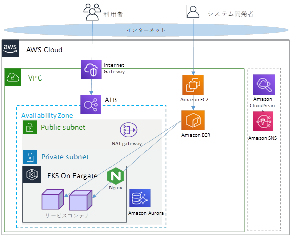

# パーソナルデータ連携モジュール 構築ガイド

# 目次
<!-- vscode-markdown-toc -->
* 1. [はじめに](#)
	* 1.1. [本ガイドの位置付け](#-1)
	* 1.2. [関連ドキュメント](#-1)
	* 1.3. [前提条件](#-1)
	* 1.4. [バージョン](#-1)
	* 1.5. [環境構成](#-1)
	* 1.6. [表記方法](#-1)
* 2. [構築手順](#-1)
	* 2.1. [資材入手](#-1)
	* 2.2. [EKSクラスター構築](#EKS)
	* 2.3. [DB構築](#DB)
	* 2.4. [CloudSearch設定](#CloudSearch)
	* 2.5. [マニフェスト作成、適用](#-1)
	* 2.6. [初期カタログの設定（流通制御サービスプロバイダーの設定）](#-1)
	* 2.7. [初期カタログの投入](#-1)
	* 2.8. [初期ユーザー登録](#-1)
* 3. [動作検証](#-1)
	* 3.1. [ログイン](#-1)
	* 3.2. [サービス設定（グローバル設定）](#-1)

<!-- vscode-markdown-toc-config
	numbering=true
	autoSave=false
	/vscode-markdown-toc-config -->
<!-- /vscode-markdown-toc -->


##  1. <a name=''></a>はじめに

###  1.1. <a name='-1'></a>本ガイドの位置付け
パーソナルデータ連携モジュール構築ガイド（以降、本書）は、
パーソナルデータ連携モジュール（以降、本モジュール）を利用するにあたり、
構築する手順を記載・説明するものである。

###  1.2. <a name='-1'></a>関連ドキュメント
本手順書に関連するドキュメントを以下に示す。

**表 1‑1 関連ドキュメント**

| ドキュメント名 | 版数 |
|---|---|
| パーソナルデータ連携モジュール 利用設定手順書 | 1.0 |
| パーソナルデータ連携モジュール アプリケーション開発ガイド | 1.0 |
| パーソナルデータ連携モジュール ビルド手順書 | 1.0 |
| 初期カタログ投入手順補助資料 | 1.0 |

###  1.3. <a name='-1'></a>前提条件
前提条件を以下に示す。

- AWSアカウントを保有していること。
- Kubernetesについて理解していること。
- インターネットへアクセス可能であること。
- EC2踏み台サーバーが準備されていること。
- EC2踏み台サーバーにroot ユーザーでログインできること。
- kubectlがインストールされていること。
- eksctlがインストールされていること。
- psqlコマンドが実行可能であること。
- DNSサーバーが準備されていること。
- データ暗号化はDBの透過的暗号機能を使用すること。

###  1.4. <a name='-1'></a>バージョン
本書で扱うソフトウェアの検証済みバージョンは以下の通り。

| 踏み台サーバーOS | Amazon Linux 2 |
|---|---|
| Kubernetes | Amazon Elastic Kubernetes Service 1.20 |
| DB | Aurora PostgreSQL 11.15 |
| Kubectl | 1.20 |
| Eksctl | 0.93.0 |
| ALB Ingress Controller | 1.1.7 |

###  1.5. <a name='-1'></a>環境構成
本手順で説明する環境構成イメージを下図に示す。



**図 1‑1 AWSを使用した環境構成イメージ**

###  1.6. <a name='-1'></a>表記方法
コマンドの表記方法は以下の通り。

（例）：

```bash
# source ~/ENV.sh <リージョン>
```

コマンド入力を表す箇所については、上記のように実線で囲んでいる。

行頭の \# はプロンプトであり、入力するのはそれ以降の部分。

\<\>で括っている部分はパラメータ。

##  2. <a name='-1'></a>構築手順
本章では、本モジュールの構築手順について記載する。

###  2.1. <a name='-1'></a>資材入手
別途通知される方法でマニフェスト、DDL、カタログを入手する。
マニフェストサンプル資材の一覧は以下の通り。別紙「利用設定手順書」の手順で使用する資材も含まれる。

```
├─configmap/
│ │ nginx-config-map.yaml
│ │　common-configmap.yaml
│ │　
│ ├─application000001/
│ │ access-control-service-container.yaml
│ │ binary-manage-service-container.yaml
│ │ book-operate-service-container.yaml
│ │ certificate-manage-service-container.yaml
│ │ local-ctoken-service-container.yaml
│ │ notification-service-container.yaml
│ │ operator-service-container.yaml
│ │ pxr-block-proxy-service-container.yaml
│ │
│ ├─region000001/
│ │ access-control-service-container.yaml
│ │ book-operate-service-container.yaml
│ │ certificate-manage-service-container.yaml
│ │ notification-service-container.yaml
│ │ operator-service-container.yaml
│ │ pxr-block-proxy-service-container.yaml
│ │
│ └─root/
│ access-control-manage-service-container.yaml
│ access-control-service-container.yaml
│ book-manage-service-container.yaml
│ book-open-service-container.yaml
│ catalog-service-container.yaml
│ catalog-update-service-container.yaml
│ certificate-authority-service-container.yaml
│ certificate-manage-service-container.yaml
│ ctoken-ledger-service-container.yaml
│ identity-verificate-service-container.yaml
│ notification-service-container.yaml
│ operator-service-container.yaml
│ pxr-block-proxy-service-container.yaml
│
├─deployment/
│ application000001-deployment.yaml
│ region000001-deployment.yaml
│ root-deployment.yaml
│
├─ingress/
│ pxr-ingress.yaml
│
└─services/
application000001-service.yaml
database-service.yaml
region000001-service.yaml
root-service.yaml
```

###  2.2. <a name='EKS'></a>EKSクラスター構築

1.  クラスターを作成する。

パラメータ：

| リージョン | ap-northeast-1(東京リージョンの場合) |
|---|---|
| クラスター名 | `pxr-cluster`(任意名称) |
| Kubernetesバージョン | 1.20 (2022年６月時点) |
| プライベートサブネットID | 事前構築したプライベートサブネットID |
| パブリックサブネットID | 事前構築したパブリックサブネットID |
| タグ | 必要に応じて設定する |

コマンド:

```bash
# eksctl create cluster \
--region <リージョン> \
--name <クラスター名> \
--version <Kubernetesバージョン> \
--fargate \
--vpc-private-subnets <プライベートサブネットID> \
--vpc-public-subnets <パブリックサブネットID> \
--tags "Owner=owner, Group=platform, Name=pxr-cluster"
```

1.  Kubeconfig接続先を更新する。

パラメータ：

| リージョン | ap-northeast-1(東京リージョンの場合) |
|---|---|
| クラスター名 | 作成したクラスター名 |

コマンド:

```bash
# aws eks update-kubeconfig \
--region <リージョン> \
--name <クラスター名>
```

1.  名前空間作成を作成する。

パラメータ：

| 名前空間 | `pxr`(任意) |
|---|---|

コマンド:

```bash
# kubectl create namespace <名前空間>
```

1.  Fargateプロファイルを作成する。

パラメータ：

| リージョン | ap-northeast-1(東京リージョンの場合) |
|---|---|
| クラスター名 | 作成したクラスター名 |
| Fargateプロファイル名 | 任意の名称 |
| 名前空間 | 任意の名称 |
| タグ | 必要に応じて設定する |

コマンド:

```bash
# eksctl create fargateprofile \
--region <リージョン> \
--cluster <クラスター名> \
--name <Fargateプロファイル名>\
--namespace <名前空間>\
--tags "Owner=owner,Group=platform,Name=pxr-fargateprofile-pxr"
```

1.  作成したクラスターのセキュリティグループを確認する。

パラメータ：

| リージョン | ap-northeast-1(東京リージョンの場合) |
|---|---|
| クラスター名 | 作成したクラスター名 |

コマンド：

```bash
# eksctl get cluster \
--region <リージョン> \
--name <クラスター名>
```

1.  ALBセキュリティグループを設定されている場合、そのセキュリティグループIDをクラスタセキュリティグループに許可追加する。

パラメータ：

| クラスターSGID | クラスタセキュリティグループID |
|---|---|
| ALB用SGID | ALBセキュリティグループID |

コマンド：

```bash
# aws ec2 authorize-security-group-ingress \
--group-id <クラスターSGID> \
--source-group <ALB用SGID> \
--protocol tcp \
--port 8080-8080
```

1.  クラスターの IAM OIDC プロバイダーを作成する。

クラスターには、OpenID Connect発行者の URL
が関連付けられている。クラスターカウントで IAM
ロールを使用するには、クラスターのための IAM OIDC
プロバイダーが存在している必要がある。

パラメータ：

| リージョン | ap-northeast-1(東京リージョンの場合) |
|---|---|
| クラスター名 | 作成したクラスター名 |

コマンド：

```bash
# eksctl utils associate-iam-oidc-provider \
--region <リージョン> \
--cluster <クラスター名> \
--approve
```

1.  AWS ALB INGRESS CONTROLLERの
    IAMポリシードキュメントをダウンロードする。

コマンド：

```bash
# curl -o iam-policy.json https://raw.githubusercontent.com/kubernetes-sigs/aws-alb-ingress-controller/v1.1.7/docs/examples/iam-policy.json
```

1.  ダウンロードしたポリシーファイルでIAMポリシー（pxr-ingress-policy）を作成する。

パラメータ：

| ポリシー名 | ap-northeast-1(東京リージョンの場合) |
|---|---|

コマンド：

```bash
# aws iam create-policy \
--policy-name pxr-ingress-policy \
--policy-document file://iam-policy.json
```

1.  設定用yamlファイルをダウンロードし、適用する。これにより、クラスターにIngressControllerサービスアカウントが作成され、クラスタロールおよびIngressControllerロールに紐づけられる。

コマンド：

```bash
# curl -o rbac-role.yaml https://raw.githubusercontent.com/kubernetes-sigs/aws-alb-ingress-controller/v1.1.7/docs/examples/rbac-role.yaml
# kubectl apply -f ./rbac-role.yaml
```

1.  クラスター認証用IAMにサービスロールを作成し、クラスターのIngressControllerサービスアカウントにアタッチする。

パラメータ：

| リージョン | ap-northeast-1(東京リージョンの場合) |
|---|---|
| クラスター名 | 作成したクラスター名 |
| 名前空間 | `kube-system` |
| ネーム | `alb-ingress-controller` |
| ポリシーARN | 9. で作成したポリシーのARN |

コマンド：

```bash
# eksctl create iamserviceaccount \
--region <リージョン> \
--name alb-ingress-controller \
--namespace kube-system \
--cluster <クラスター名> \
--attach-policy-arn <ポリシーARN> \
--override-existing-serviceaccounts \
--approve
```

1.  IngressControllerデプロイマニフェストファイルをダウンロードし、適用する。

コマンド：

```bash
# curl -o alb-ingress-controller.yaml https://raw.githubusercontent.com/kubernetes-sigs/aws-alb-ingress-controller/v1.1.7/docs/examples/alb-ingress-controller.yaml
# kubectl apply -f ./alb-ingress-controller.yaml
```

1.  IngressControllerデプロイマニフェストを編集する。

パラメータ：

| リージョン | ap-northeast-1(東京リージョンの場合) |
|---|---|
| クラスター名 | 作成したクラスター名 |
| VPCID | VPCのID |

編集例：

```yaml
spec:
containers:
- args:
  - --ingress-class=alb
  - --cluster-name=<クラスター名>
  - --aws-vpc-id=<VPCID>
  - --aws-region=ap-northeast-1
```

<span id="_Ref106354309" class="anchor"></span>

###  2.3. <a name='DB'></a>DB構築

本節ではデータベースに接続済み前提で記述する。

1.  各サービス接続用ユーザーを作成する。

パラメータ：

| プレフィックス | データベースなどデータベースごとにユニークとなる文字列 |
|---|---|
| パスワード | セキュリティ要件に合わせて各ユーザーのパスワードを指定する |

※プレフィックスは後続手順のパラメータとしても使用する。

コマンド：

```sql
CREATE USER <プレフィックス>_access_control_user WITH PASSWORD ‘<パスワード>’;
CREATE USER <プレフィックス>_access_manage_user WITH PASSWORD ‘<パスワード>’;
CREATE USER <プレフィックス>_book_manage_user WITH PASSWORD ‘<パスワード>’;
CREATE USER <プレフィックス>_binary_manage_user WITH PASSWORD ‘<パスワード>’;
CREATE USER <プレフィックス>_book_operate_user WITH PASSWORD ‘<パスワード>’;
CREATE USER <プレフィックス>_catalog_user WITH PASSWORD ‘<パスワード>’;
CREATE USER <プレフィックス>_catalog_update_user WITH PASSWORD ‘<パスワード>’;
CREATE USER <プレフィックス>_certification_authority_user WITH PASSWORD ‘<パスワード>’;
CREATE USER <プレフィックス>_certificate_manage_user WITH PASSWORD ‘<パスワード>’;
CREATE USER <プレフィックス>_identify_verify_user WITH PASSWORD ‘<パスワード>’;
CREATE USER <プレフィックス>_notification_user WITH PASSWORD ‘<パスワード>’;
CREATE USER <プレフィックス>_operator_user WITH PASSWORD ‘<パスワード>’;
CREATE USER <プレフィックス>_block_proxy_user WITH PASSWORD ‘<パスワード>’;
CREATE USER <プレフィックス>_ctoken_ledger_user WITH PASSWORD ‘<パスワード>’;
CREATE USER <プレフィックス>_local_ctoken_user WITH PASSWORD ‘<パスワード>’;
```

1.  DBユーザー継承

※下記コマンドはDBのマスターユーザーがpostgresの場合の例である。

コマンド：

```sql
GRANT <プレフィックス>_access_control_user TO postgres;
GRANT <プレフィックス>_access_manage_user TO postgres;
GRANT <プレフィックス>_book_manage_user TO postgres;
GRANT <プレフィックス>_binary_manage_user TO postgres;
GRANT <プレフィックス>_book_operate_user TO postgres;
GRANT <プレフィックス>_catalog_user TO postgres;
GRANT <プレフィックス>_catalog_update_user TO postgres;
GRANT <プレフィックス>_certification_authority_user TO postgres;
GRANT <プレフィックス>_certificate_manage_user TO postgres;
GRANT <プレフィックス>_identify_verify_user TO postgres;
GRANT <プレフィックス>_notification_user TO postgres;
GRANT <プレフィックス>_operator_user TO postgres;
GRANT <プレフィックス>_block_proxy_user TO postgres;
GRANT <プレフィックス>_ctoken_ledger_user TO postgres;
GRANT <プレフィックス>_local_ctoken_user TO postgres;
```

1.  データベース作成

パラメータ：

| データベース名 | 任意(例: `root_pod`) |
|---|---|

コマンド：

```sql
create database <データベース名> ENCODING 'UTF-8';
```

1.  スキーマ作成

コマンド：

```sql
CREATE SCHEMA pxr_access_control AUTHORIZATION <プレフィックス>_access_control_user;
CREATE SCHEMA pxr_access_manage AUTHORIZATION <プレフィックス>_access_manage_user;
CREATE SCHEMA pxr_binary_manage AUTHORIZATION <プレフィックス>_binary_manage_user;
CREATE SCHEMA pxr_book_manage AUTHORIZATION <プレフィックス>_book_manage_user;
CREATE SCHEMA pxr_book_operate AUTHORIZATION <プレフィックス>_book_operate_user;
CREATE SCHEMA pxr_catalog AUTHORIZATION <プレフィックス>_catalog_user;
CREATE SCHEMA pxr_catalog_update AUTHORIZATION <プレフィックス>_catalog_update_user;
CREATE SCHEMA pxr_certification_authority AUTHORIZATION <プレフィックス>_certification_authority_user;
CREATE SCHEMA pxr_certificate_manage AUTHORIZATION <プレフィックス>_certificate_manage_user;
CREATE SCHEMA pxr_identify_verify AUTHORIZATION <プレフィックス>_identify_verify_user;
CREATE SCHEMA pxr_notification AUTHORIZATION <プレフィックス>_notification_user;
CREATE SCHEMA pxr_operator AUTHORIZATION <プレフィックス>_operator_user;
CREATE SCHEMA pxr_block_proxy AUTHORIZATION <プレフィックス>_block_proxy_user;
CREATE SCHEMA pxr_ctoken_ledger AUTHORIZATION <プレフィックス>_ctoken_ledger_user;
CREATE SCHEMA pxr_local_ctoken AUTHORIZATION <プレフィックス>_local_ctoken_user;
```

1.  テーブル作成

PxR-Root-Blockの各サービスのcreateTable.sqlを実行する。

コマンド：

`createTable.sql`ファイルを実行

1.  権限追加

ユーザーの権限を追加する。

コマンド：

```sql
GRANT ALL PRIVILEGES ON pxr_access_manage.token_generation_history TO <プレフィックス>_access_manage_user;
GRANT ALL PRIVILEGES ON pxr_access_manage.token_access_history TO <プレフィックス>_access_manage_user;
GRANT ALL PRIVILEGES ON pxr_access_manage.caller_role TO <プレフィックス>_access_manage_user;
GRANT ALL PRIVILEGES ON pxr_access_manage.token_generation_history_id_seq TO <プレフィックス>_access_manage_user;
GRANT ALL PRIVILEGES ON pxr_access_manage.token_access_history_id_seq TO <プレフィックス>_access_manage_user;
GRANT ALL PRIVILEGES ON pxr_access_manage.caller_role_id_seq TO <プレフィックス>_access_manage_user;
GRANT ALL PRIVILEGES ON pxr_access_control.api_access_permission TO <プレフィックス>_access_control_user;
GRANT ALL PRIVILEGES ON pxr_access_control.caller_role TO <プレフィックス>_access_control_user;
GRANT ALL PRIVILEGES ON pxr_access_control.api_token TO <プレフィックス>_access_control_user;
GRANT ALL PRIVILEGES ON pxr_access_control.api_access_permission_id_seq TO <プレフィックス>_access_control_user;
GRANT ALL PRIVILEGES ON pxr_access_control.api_token_id_seq TO <プレフィックス>_access_control_user;
GRANT ALL PRIVILEGES ON pxr_access_control.caller_role_id_seq TO <プレフィックス>_access_control_user;
GRANT ALL PRIVILEGES ON ALL TABLES IN SCHEMA pxr_binary_manage TO <プレフィックス>_binary_manage_user;
GRANT ALL PRIVILEGES ON ALL SEQUENCES IN SCHEMA pxr_binary_manage TO <プレフィックス>_binary_manage_user;
GRANT ALL PRIVILEGES ON pxr_block_proxy.log_called_api TO <プレフィックス>_block_proxy_user;
GRANT ALL PRIVILEGES ON pxr_block_proxy.log_called_api_id_seq TO <プレフィックス>_block_proxy_user;
GRANT ALL PRIVILEGES ON ALL TABLES IN SCHEMA pxr_book_manage TO <プレフィックス>_book_manage_user;
GRANT ALL PRIVILEGES ON ALL SEQUENCES IN SCHEMA pxr_book_manage TO <プレフィックス>_book_manage_user;
GRANT ALL PRIVILEGES ON ALL TABLES IN SCHEMA pxr_book_operate TO <プレフィックス>_book_operate_user;
GRANT ALL PRIVILEGES ON ALL SEQUENCES IN SCHEMA pxr_book_operate TO <プレフィックス>_book_operate_user;
GRANT ALL PRIVILEGES ON ALL TABLES IN SCHEMA pxr_catalog TO <プレフィックス>_catalog_user;
GRANT ALL PRIVILEGES ON ALL SEQUENCES IN SCHEMA pxr_catalog TO <プレフィックス>_catalog_user;
GRANT ALL PRIVILEGES ON ALL TABLES IN SCHEMA pxr_catalog_update TO <プレフィックス>_catalog_update_user;
GRANT ALL PRIVILEGES ON ALL SEQUENCES IN SCHEMA pxr_catalog_update TO <プレフィックス>_catalog_update_user;
GRANT ALL PRIVILEGES ON ALL TABLES IN SCHEMA pxr_certificate_manage TO <プレフィックス>_certificate_manage_user;
GRANT ALL PRIVILEGES ON ALL SEQUENCES IN SCHEMA pxr_certificate_manage TO <プレフィックス>_certificate_manage_user;
GRANT ALL PRIVILEGES ON ALL TABLES IN SCHEMA pxr_certification_authority TO <プレフィックス>_certification_authority_user;
GRANT ALL PRIVILEGES ON ALL SEQUENCES IN SCHEMA pxr_certification_authority TO <プレフィックス>_certification_authority_user;
GRANT ALL PRIVILEGES ON pxr_ctoken_ledger.ctoken TO <プレフィックス>_ctoken_ledger_user;
GRANT ALL PRIVILEGES ON pxr_ctoken_ledger.ctoken_id_seq TO <プレフィックス>_ctoken_ledger_user;
GRANT ALL PRIVILEGES ON pxr_ctoken_ledger.ctoken_history TO <プレフィックス>_ctoken_ledger_user;
GRANT ALL PRIVILEGES ON pxr_ctoken_ledger.ctoken_history_id_seq TO <プレフィックス>_ctoken_ledger_user;
GRANT ALL PRIVILEGES ON pxr_ctoken_ledger.cmatrix TO <プレフィックス>_ctoken_ledger_user;
GRANT ALL PRIVILEGES ON pxr_ctoken_ledger.cmatrix_id_seq TO <プレフィックス>_ctoken_ledger_user;
GRANT ALL PRIVILEGES ON pxr_ctoken_ledger.row_hash TO <プレフィックス>_ctoken_ledger_user;
GRANT ALL PRIVILEGES ON pxr_ctoken_ledger.row_hash_id_seq TO <プレフィックス>_ctoken_ledger_user;
GRANT ALL PRIVILEGES ON pxr_ctoken_ledger.document TO <プレフィックス>_ctoken_ledger_user;
GRANT ALL PRIVILEGES ON pxr_ctoken_ledger.document_id_seq TO <プレフィックス>_ctoken_ledger_user;
GRANT ALL PRIVILEGES ON ALL TABLES IN SCHEMA pxr_identify_verify TO <プレフィックス>_identify_verify_user;
GRANT ALL PRIVILEGES ON ALL SEQUENCES IN SCHEMA pxr_identify_verify TO <プレフィックス>_identify_verify_user;
GRANT ALL PRIVILEGES ON pxr_local_ctoken.row_hash TO <プレフィックス>_local_ctoken_user;
GRANT ALL PRIVILEGES ON pxr_local_ctoken.row_hash_id_seq TO <プレフィックス>_local_ctoken_user;
GRANT ALL PRIVILEGES ON pxr_local_ctoken.document TO <プレフィックス>_local_ctoken_user;
GRANT ALL PRIVILEGES ON pxr_local_ctoken.document_id_seq TO <プレフィックス>_local_ctoken_user;
GRANT ALL PRIVILEGES ON pxr_notification.notification TO <プレフィックス>_notification_user;
GRANT ALL PRIVILEGES ON pxr_notification.notification_destination TO <プレフィックス>_notification_user;
GRANT ALL PRIVILEGES ON pxr_notification.readflag_management TO <プレフィックス>_notification_user;
GRANT ALL PRIVILEGES ON pxr_notification.approval_managed TO <プレフィックス>_notification_user;
GRANT ALL PRIVILEGES ON pxr_notification.notification_id_seq TO <プレフィックス>_notification_user;
GRANT ALL PRIVILEGES ON pxr_notification.notification_destination_id_seq TO <プレフィックス>_notification_user;
GRANT ALL PRIVILEGES ON pxr_notification.readflag_management_id_seq TO <プレフィックス>_notification_user;
GRANT ALL PRIVILEGES ON pxr_notification.approval_managed_id_seq TO <プレフィックス>_notification_user;
GRANT ALL PRIVILEGES ON ALL TABLES IN SCHEMA pxr_operator TO <プレフィックス>_operator_user;
GRANT ALL PRIVILEGES ON ALL SEQUENCES IN SCHEMA pxr_operator TO <プレフィックス>_operator_user;
```

###  2.4. <a name='CloudSearch'></a>CloudSearch設定

1.  CloudSearchドメインを作成する。

パラメータ：

| ドメイン名 | cloudsearchドメイン名 |
|------------|-----------------------|

コマンド：

```bash
# aws cloudsearch create-domain --domain-name <ドメイン名>
```

1.  Index Options設定

パラメータ：

| ドメイン名 | cloudsearchドメイン名 |
|------------|-----------------------|

その他パラメータは固定値。

コマンド：

```bash
# aws cloudsearch define-index-field \
--domain-name <ドメイン名> \
--name description \
--type text \
--return-enabled true \
--sort-enabled true \
--highlight-enabled true \
--analysis-scheme _ja_default_

# aws cloudsearch define-index-field \
--domain-name <ドメイン名> \
--name name \
--type text \
--return-enabled true \
--sort-enabled true \
--highlight-enabled true \
--analysis-scheme _ja_default_

# aws cloudsearch define-index-field \
--domain-name <ドメイン名> \
--name code \
--type int \
--facet-enabled true \
--return-enabled true \
--sort-enabled true

# aws cloudsearch define-index-field \
--domain-name <ドメイン名> \
--name id \
--type int \
--facet-enabled true \
--return-enabled true \
--sort-enabled true
```

1.  インデックスを作成する。

パラメータ：

| ドメイン名 | CloudSearchドメイン名 |
|------------|-----------------------|

コマンド：

```bash
aws cloudsearch index-documents --domain-name <ドメイン名>
```

1.  Access Policies設定

以下のガイドを参考にCloudSearchドメインにアクセスできるよう設定する。

<https://docs.aws.amazon.com/ja_jp/cloudsearch/latest/developerguide/configuring-access.html>

###  2.5. <a name='-1'></a>マニフェスト作成、適用

1.  資材入手

「2.1 資材入手」で取得したマニフェスト資材を使って以下手順を実施する。

1.  Configmap編集

入手したマニフェスト内の以下の埋め込み文字列に対し以下の置換を行う。

| 埋め込み文字列 | 置換内容 |
|---|---|
| `<ext_name>` | カタログの拡張名前空間(ext)に設定する名称を設定 |
| `<cloudsearch-endpoint>` | CloudSearchドメインのSearchEndpointを設定 |
| `<password_hashsalt>` | パスワードハッシュ化のソルト値(文字列) |
| `<password_hashStrechCount>` | パスワードハッシュ化のストレッチ回数(整数値) |
| `<db_endpoint>` | データベースエンドポイント |
| `<namespace>` | 名前空間 |
| `<domain.com>` | 自身のドメイン名 |

1.  ormconfig.json編集

各コンテナのyamlファイルのormconfig.json定義部分を、DB構築時に設定した値に合わせる。

設定例：

```json
ormconfig.json: |
{
  “name”: “postgres”,
  “type”: “postgres”,
  “host”: “external-db-service”,
  “port”: 5432,
  “database”: “<database_name>”, // 2.3 DB構築の3.で作成したデータベース名
  “schema”: “schema”,  // 2.3 DB構築で作成した固定名称
  “username”: “<user_name>”, // 2.3 DB構築の1.作成したユーザー
  “password”: “<password>”, // 2.3 DB構築の1. 作成したユーザー
  “synchronize”: false,
  “logging”: false
}
```

修正必要なファイルは以下の通り。

| ファイル名 |
|---|
| `access-control-manage-service-container.yaml` |
| `access-control-service-container.yaml` |
| `book-manage-service-container.yaml` |
| `book-open-service-container.yaml` |
| `catalog-service-container.yaml` |
| `catalog-update-service-container.yaml` |
| `certificate-authority-service-container.yaml` ※ |
| `certificate-manage-service-container.yaml` ※ |
| `ctoken-ledger-service-container.yaml` |
| `identity-verificate-service-container.yaml` |
| `notification-service-container.yaml` |
| `operator-service-container.yaml` |
| `pxr-block-proxy-service-container.yaml` |

※configmap内.envの設定もDB接続情報が設定必要。

1.  Deployment編集

入手したdeploymentサンプルを編集する。

コンテナimage指定部分を作成したイメージのURLを指定する。
以下のように{イメージ名}:{タグ}をビルド手順書5.1.Dockerコンテナイメージを作成するイメージ名とタグに置き換える。

（変更前）
　image: 123456789012.dkr.ecr.ap-northeast-1.amazonaws.com/{イメージ名}:{タグ}

（変更例）
　image: 123456789012.dkr.ecr.ap-northeast-1.amazonaws.com/pxr-operator-service:v1.0.0

設定例：

```yaml
apiVersion: apps/v1
kind: Deployment
metadata:
  name: root-api
  namespace: pxr
spec:
  replicas: 1
  selector:
    matchLabels:
      app: root-api
  template:
    metadata:
      labels:
        app: root-api
    spec:
      - name: pxr-operator-service
        image: 123456789012.dkr.ecr.ap-northeast-1.amazonaws.com/{イメージ名}:{タグ}
        imagePullPolicy: IfNotPresent
        resources:
          requests:
            cpu: 210m
            memory: 310Mi
          limits:
            cpu: 1000m
            memory: 1000Mi
        ports:
          - containerPort: 3000
        volumeMounts:
          - mountPath: /usr/src/app/config
            readOnly: true
            name: operator-service-config
```

1.  ロードバランサー作成

ALB Ingress
Controllerを使ってALBを作成する場合、以下Ingress定義を参考とする。

セキュリティグループ、証明書、WAFなどセキュリティに関する設定は必要に応じて設定すること。

yaml設定例：

```yaml
apiVersion: extensions/v1beta1
kind: Ingress
metadata:
  annotations:
    kubernetes.io/ingress.class: alb
    alb.ingress.kubernetes.io/scheme: internet-facing
    alb.ingress.kubernetes.io/target-type: ip
    alb.ingress.kubernetes.io/listen-ports: '[{"HTTPS": 443}]'
    alb.ingress.kubernetes.io/certificate-arn: <AWS Certificate Manager証明書ARN>
    alb.ingress.kubernetes.io/security-groups: <セキュリティグループ>
    alb.ingress.kubernetes.io/wafv2-acl-arn: <AWS WAF Web ACL ARN>
    alb.ingress.kubernetes.io/ssl-policy: ELBSecurityPolicy-FS-1-2-Res-2019-08
    alb.ingress.kubernetes.io/load-balancer-attributes: idle_timeout.timeout_seconds=120
  name: pxr-ingress
  namespace: pxr
spec:
  rules:
    - host: root.xxxxx.me.uk
      http:
        paths:
          - path: /*
            backend:
              serviceName: root-service
              servicePort: 80
  ...
```

1.  証明書とRSA鍵のSecretを作成
　公的証明書、自己証明書のどちらでも問題はないが、本手順ではSSL自己証明書を作成している。

サーバー証明書（server.crt）、RSA鍵（server.key）を作成する。

```bash
openssl genrsa 2048 > server.key
openssl req -new -key server.key > server.csr
cat server.csr | openssl x509 -req -signkey server.key > server.crt
```

クライアント証明書（client.crt）、RSA鍵（client.key）を作成する。

```bash
openssl genrsa 2048 > client.key
openssl req -new -key client.key > client.csr
cat client.csr | openssl x509 -req -signkey client.key > client.crt
```

下記パラメータとコマンドでSecretを作成する。

パラメータ：

| 名前空間 | 任意の名称 |
|-|-|

```bash
kubectl create secret generic nginx-secret \
--from-file=server.crt \
--from-file=server.key \
--from-file=client.crt \
--from-file=client.key -n <名前空間>
```

1.  マニフェスト適用

前項の手順で編集したマニフェストおよびIngressYamlを適用する。マニフェストの適用には基本的にapplyで適用できるが、ファイルサイズオーバーにより失敗する場合、createやreplaceを使って適用する。

```bash
# kubectl apply -f ファイル名またはフォルダ名
# kubectl create -f ファイル名またはフォルダ名
# kubectl replace -f ファイル名またはフォルダ名
```

コマンド：

1.  Pod起動確認

Podがrunning状態になっていることを確認する。

コマンド：

```bash
# kubectl get pod -n pxr
```

###  2.6. <a name='-1'></a>初期カタログの設定（流通制御サービスプロバイダーの設定）

1.  資材入手

2.1で取得したカタログ資材に対して流通制御サービスプロバイダーの設定を行う。

1.  設定値の置換

　\<利用者設定値\>を実際の値に置換する。

※フォルダ名の場合は{利用者設定値}となる。

　※数値（コード）は1000001～10000000の任意の数値を指定する。

　※**（v1.2）数値（コード）を以下の設定例記載以外に変更した場合、マニフェスト記載のカタログコードを置換する必要がある。**

| 利用者設定値 | マニフェストの設定値 | 置換対象ファイル<br/>(manifest/eks/configmap/は共通のため省略) |
|---|---|---|
| `global_setting_code` | 1000374 | `root/book-manage-service-container.yaml` |
| `pxr_root_actor_code` | 1000431 | `root/book-manage-service-container.yaml`<br/>`common-configmap.yaml` |
| `pxr_root_block_code` | 1000401 | `common-configmap.yaml`<br/>`application000001/book-operate-service-container.yaml`<br/>`application000001/operator-service-container.yaml`<br/>`application000001/pxr-block-proxy-service-container.yaml`<br/>`region000001/book-operate-service-container.yaml`<br/>`region000001/pxr-block-proxy-service-container.yaml`<br/>`root/access-control-manage-service-container.yaml`<br/>`root/catalog-update-service-container.yaml`<br/>`root/pxr-block-proxy-service-container.yaml` |
| `person_item_type_address_code` | 1000371 | `root/catalog-service-container.yaml` |
| `person_item_type_yob_code` | 1000372 | `root/catalog-service-container.yaml` |
| `pxr_root_user_information_code` | 1000373 | `application000001/operator-service-container.yaml`<br/>`region000001/operator-service-container.yaml`<br/>`root/operator-service-container.yaml` |

フォルダ名

| 利用者設定値 | 説明 | 形式 | 設定例 |
|---|---|---|---|
| `ext_name` | 個別のext名 | 文字列(半角英数字) | 2.5で設定したext_name |
| `pxr_root_actor_code` | 流通制御アクターのカタログコード | 数値(コード) | 1000431 |

全体で使用される利用者設定値

| 利用者設定値 | 説明 | 形式 | 設定例 |
|---|---|---|---|
| `ext_name` | 個別のext名 | 文字列 | 2.5で設定したext_name |
| `pxr_root_name` | 流通制御サービスプロバイダーの名称 | 文字列 | 流通制御サービスプロバイダー |
| `global_setting_code` | グローバル設定のカタログコード | 数値(コード) | 1000374 |
| `pf_terms_code` | PF利用規約のカタログコード | 数値(コード) | 1000500 |
| `actor_setting_code` | 流通制御アクター個別設定のカタログコード | 数値(コード) | 1000731 |
| `actor_own_setting_code` | 流通制御アクター固有設定のカタログコード | 数値(コード) | 1000781 |
| `pxr_root_actor_code` | 流通制御アクターのカタログコード | 数値(コード) | 1000431 |
| `pxr_root_block_code` | 流通制御ブロックのカタログコード | 数値(コード) | 1000401 |
| `person_item_type_address_code` | 個人属性の項目種別(住所(行政区))のカタログコード | 数値(コード) | 1000371 |
| `person_item_type_yob_code` | 個人属性の項目種別(生年(西暦))のカタログコード | 数値(コード) | 1000372 |
| `pxr_root_user_information_code` | 流通制御サービスプロバイダーで利用する利用者情報のカタログコード | 数値(コード) | 1000373 |

・society_catalog.json

で使用される利用者設定値

| 利用者設定値 | 説明 | 形式 | 設定例 |
|-|-|-|-|
| `catalog_description` | カタログデータの説明テキスト | 文字列 | パーソナルデータ連携モジュールが提供するデータカタログです。 |

設定例: `/ext/{ext_name}/actor/pxr-root/流通制御サービスプロバイダー_item.json`

| 利用者設定値 | 説明 | 形式 | 設定例 |
|---|---|---|---|
| `pf_description_title` | PF概要のタイトル | 文字列 | プラットフォーム概要 |
| `pf_description_subtitle` | PF概要のサブタイトル | 文字列 | プラットフォーム概要 |
| `pf_description_sentence` | PF概要のテキスト | 文字列 | プラットフォーム概要～ |
| `region_certification_criteria_title` | 領域運営サービスプロバイダー認定基準のタイトル | 文字列 | 領域運営サービスプロバイダーの認定基準 |
| `region_certification_criteria_sentence` | 領域運営サービスプロバイダー認定基準のテキスト | 文字列 | 領域運営サービスプロバイダーの認定基準です。 |
| `region_audit_procedure_title` | 領域運営サービスプロバイダーの監査手順のタイトル | 文字列 | 領域運営サービスプロバイダーの監査手順 |
| `region_audit_procedure_sentence` | 領域運営サービスプロバイダーの監査手順のテキスト | 文字列 | 領域運営サービスプロバイダーの監査手順です。 |
| `app_certification_criteria_title` | アプリケーションプロバイダー認定基準のタイトル | 文字列 | アプリケーションプロバイダーの認定基準 |
| `app_certification_criteria_sentence` | アプリケーションプロバイダー認定基準のテキスト | 文字列 | アプリケーションプロバイダーの認定基準です。 |
| `app_audit_procedure_title` | アプリケーションプロバイダーの監査手順のタイトル | 文字列 | アプリケーションプロバイダーの監査手順 |
| `app_audit_procedure_sentence` | アプリケーションプロバイダーの監査手順のテキスト | 文字列 | アプリケーションプロバイダーの監査手順です。 |
| `organization_statement_title` | 組織ステートメントのタイトル | 文字列 | 組織ステートメント |
| `organization_statement_subtitle` | 組織ステートメントのサブタイトル | 文字列 | 組織ステートメント |
| `organization_statement_sentence` | 組織ステートメントのテキスト | 文字列 | パーソナルデータ連携モジュールを運営する流通制御サービスプロバイダーです。 |

設定例: `/ext/{ext_name}/block/pxr-root/PXR-Root-Block_item.json`

| 利用者設定値 | 説明 | 形式 | 設定例 |
|---|---|---|---|
| `domain` | 流通制御サービスプロバイダーのドメイン | 文字列 | `domain.sample-pxr.jp` |

設定例: `/ext/{ext_name}/setting/actor-own/pxr-root/actor_{pxr_root_actor_code}/setting_item.json`

| 利用者設定値 | 説明 | 形式 | 設定例 |
|---|---|---|---|
| `email-address` | 問い合わせ先のメールアドレス | 文字列 | `test@test.jp` |
| `tel-number` | 問い合わせ先の電話番号 | 文字列(電話番号) | `000-0000-0000` |
| `address` | 問い合わせ先の住所 | 文字列 | 〇〇県〇〇市〇〇町 |
| `information-site` | 問い合わせ先のURL | 文字列 | `test.jp` |

設定例: `/ext/{ext_name}/setting/global/setting_item.json`

| 利用者設定値 | 説明 | 形式 | 設定例 |
|---|---|---|---|
| `management_password_similarity_check` | 運営メンバーのパスワード類似性チェック有無を指定する | true/false | true |
| `pxr_id_prefix` | PxR-ID(個人のID)のprefixを指定する | 文字列 | AAAA |
| `pxr_id_suffix` | PxR-ID(個人のID)のsuffixを指定する | 文字列 | BBBB |
| `pxr_id_password_similarity_check` | PxR-IDのパスワード類似性チェックの有無を指定する | true/false | true |
| `identity-verification-expiration_type` | 本人性確認コードの有効期限の日付タイプを指定する | month/day/hour/minute/second | day |
| `identity-verification-expiration_value` | 本人性確認コードの有効期限の数値を指定する | 数値 | 7 |
| `password-expiration_type` | 運営メンバー・個人のパスワード有効期限の日付タイプを指定する | month/day/hour/minute/second | day |
| `password-expiration_value` | 運営メンバー・個人のパスワード有効期限の数値を指定する | 数値 | 90 |
| `password-generations-number` | 運営メンバー・個人のパスワード更新時について、過去何世代まで同じパスワードを許可しないかを指定する | 数値 | 4 |
| `session-expiration_type` | 運営・個人ポータルで未操作(画面遷移しない)状態におけるセッション有効期限の日付タイプを指定する | month/day/hour/minute/second | hour |
| `session-expiration_value` | 運営・個人ポータルで未操作(画面遷移しない)状態におけるセッション有効期限の数値を指定する | 数値 | 3 |
| `account-lock-count` | PxR-Blockログイン時のパスワード入力ミスを何回まで許容するかを指定する | 数値 | 6 |
| `account-lock-release-time_type` | アカウントロック解除までの時間の日付タイプを指定する | month/day/hour/minute/second | minute |
| `account-lock-release-time_value` | アカウントロック解除までの時間の数値を指定する | 数値 | 30 |
| `login_sms_message` | 個人によるPxR-Root-Blockログイン時に送信されるSMSメッセージ内容を指定する | 文字列 | Your code is %s |
| `book_create_sms_message` | My-Condition-Book開設時に送信されるSMSメッセージ内容を指定する | 文字列 | %s?ID=%s パスワードは次のメッセージでお送りします |
| `personal_disassociation` | 個人の連携解除の使用可否を指定する | true/false | true |
| `personal_two-step_verification` | 個人によるPxR-Root-Blockログイン時の2段階認証解除を許可するかを指定する | true/false | true |
| `personal_share_basic_policy` | 個人の共有の基本方針可否設定を指定する | true/false | false |
| `personal_account_delete` | 個人による自身のアカウント削除を許可するかを指定する | true/false | false |
| `use_app-p` | アプリケーションプロバイダーの使用可否を指定する | true/false | true |
| `use_share` | ドキュメント共有の使用設定を指定する | true/false | true |
| `region-tou_re-consent_notification_interval_type` | 領域運営サービスプロバイダーのリージョン利用規約通知間隔の日付タイプを指定する | month/day/hour/minute/second | day |
| `region-tou_re-consent_notification_interval_value` | 領域運営サービスプロバイダーのリージョン利用規約通知間隔の数値を指定する | 数値 | 3 |
| `platform-tou_re-consent_notification_interval_type` | プラットフォーム利用規約通知間隔の日付タイプを指定する | month/day/hour/minute/second | day |
| `platform-tou_re-consent_notification_interval_value` | プラットフォーム利用規約通知間隔の数値を指定する | 数値 | 3 |
| `use_region_service_operation` | リージョンサービスの運用有無の設定を指定する | true/false | true |
| `min_period_for_platform-tou_re-consent_type` | プラットフォーム利用規約の再同意期限の最低期間の日付タイプを指定する | month/day/hour/minute/second | day |
| `min_period_for_platform-tou_re-consent_value` | プラットフォーム利用規約の再同意期限の最低期間の数値を指定する | 数値 | 7 |
| `min_period_for_region-tou_re-consent_type` | リージョン利用規約の再同意期限の最低期間の日付タイプを指定する | month/day/hour/minute/second | day |
| `min_period_for_region-tou_re-consent_value` | リージョン利用規約の再同意期限の最低期間の数値を指定する | 数値 | 7 |
| `book_deletion_pending_term_type` | My-Condition-Bookの削除保留期間の日付タイプを指定する | month/day/hour/minute/second | day |
| `book_deletion_pending_term_value` | My-Condition-Bookの削除保留期間の数値を指定する | 数値 | 14 |
| `data_download_term_expiration_type` | 署名付きURLによるデータ出力有効期間の日付タイプを指定する | month/day/hour/minute/second | day |
| `data_download_term_expiration_value` | 署名付きURLによるデータ出力有効期間の数値を指定する | 数値 | 14 |

設定例: `/ext/{ext_name}/terms-of-use/platform/pf-terms-of-use_item.json`

| 利用者設定値 | 説明 | 形式 | 設定例 |
|---|---|---|---|
| `pf_terms_title` | PF利用規約概要のタイトル | 文字列 | プラットフォーム利用規約 |
| `pf_terms_subtitle` | PF利用規約概要のサブタイトル | 文字列 | 第1項 |
| `pf_terms_sentence` | PF利用規約概要のテキスト | 文字列 | 規約～～～。 |
| `re-consent-flag` | 個人の再同意要否フラグ | true/false | false |
| `period-of-re-consent` | 再同意締め切り日時 | 日付 | null |
| `deleting-data-flag` | データ削除フラグ | true/false | true |
| `returning-data-flag` | データ返却フラグ | true/false | true |

###  2.7. <a name='-1'></a>初期カタログの投入

本節の手順を実行する前に、以下の前提条件を満たしていること。

・PxR-Root‐Block起動済みであること。

・CloudSearchのドメインにアクセスできること。


1.  資材入手

2.1で設定したカタログ資材を使って以下手順を実施する。

1.  Nodeモジュールインストール

コマンド：

```bash
$ npm ci
```

1.  EC2踏み台サーバーでカタログ投入ツールを実行し、初期カタログを投入する。
　※エラーが発生した場合は「初期カタログ投入手順補助資料」を参照（pxr-linkage/doc/導入ガイドライン/初期カタログ投入手順補助資料v1.0.pdf）


パラメータ：

| PxR-Root-BlockのFQDN | 例: `root.xxxxx.co.jp` |
|---|---|

コマンド：

```bash
$ node catalogRegister.js <PxR-Root-BlockのFQDN>
```

1.  Catalogコンテナ直アクセス制限

> nginx-config-map.yamlを編集する。ファイル中下記部分を削除する。

```
location /catalog/ {
  proxy_pass http://localhost:3001/;
}
```

編集完了したら適用を実施する。適用方法は2.5の7．を参照すること。

###  2.8. <a name='-1'></a>初期ユーザー登録

1.  ハッシュ化（SHA-256）パスワード生成

2.5の1．で決定したソルト値、ストレッチング回数で、パスワード＋ソルト値の文字列でストレッチング回数分をストレッチングする。

※詳細はpxr-book-manage-service\src\common\Password.ts を参照。

1.  初期ユーザー登録

0で作成したデータベースに接続し、初期ユーザーのデータを追加する。

パラメータ：

| ユーザーID | 英数字 |
|---|---|
| ハッシュ化パスワード | 1. で生成したパスワード |
| ユーザー名 | 任意文字列 |

コマンド：

```sql
INSERT INTO pxr_operator.operator (type, login_id, hpassword, name, auth, password_changed_flg, login_prohibited_flg, attributes, lock_flg, is_disabled, created_by, updated_by, unique_check_login_id)
VALUES
(3, ‘<ユーザーID>’, ‘<ハッシュ化パスワード>’, ‘<ユーザー名>’, ‘{"member":{"add":true,"update":true,"delete":true},"actor":{"application":true,"approval":true},"book":{"create":true},"catalog":{"create":true},"setting":{"update":true}}’, false, false, ‘{}’, false, false, ‘root_member001’, ‘root_member001’, ‘<ユーザーID>3’);
```

##  3. <a name='-1'></a>動作検証

###  3.1. <a name='-1'></a>ログイン

構築した流通制御サービスプロバイダーの環境にログインできることを確認する。
　※エラーが発生した場合は「初期カタログ投入手順補助資料」を参照（pxr-linkage/doc/導入ガイドライン/初期カタログ投入手順補助資料v1.0.pdf）


パラメータ：

| ユーザーID | 2.8の2. で登録したユーザーID |
|---|---|
| ハッシュ化パスワード | 2.8の2. で登録したハッシュ化パスワード |
| URL | PxR-Root-BlockのURL |

コマンド：

```bash
curl -X POST -H "Content-Type: application/json" -d '{"type": 3, "loginId": "<ユーザー名>", "hpassword": "<ハッシュ化パスワード>"}' https://<URL>/operator/operator/login
```

他運営メンバーを追加する場合、「パーソナルデータ連携モジュール
利用設定手順書」の4.2 運営メンバーの追加を実施する。

###  3.2. <a name='-1'></a>サービス設定（グローバル設定）

グローバル設定を初期カタログ設定値から変更する場合、「パーソナルデータ連携モジュール
利用設定手順書」の4.1 グローバル設定（Block共通設定）を実行する。
